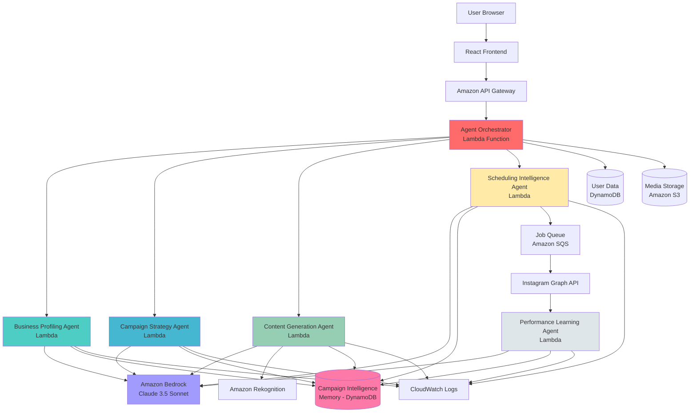

# Design Document: PostPilot AI (AI-First Multi-Agent Architecture)

## Overview

PostPilot AI is an AI-driven autonomous content orchestration platform that uses multiple specialized AI agents to automate social media presence for businesses. Unlike traditional rule-based systems, this platform employs intelligent agents that learn from campaign performance, adapt strategies, and continuously improve content quality through a shared Campaign Intelligence Memory.

### System Purpose

The platform transforms social media automation from static scheduling to intelligent orchestration by:
- Using AI agents to reason about business context and campaign strategy
- Learning from past campaign performance to improve future content
- Adapting content tone, timing, and style based on analytics feedback
- Autonomously generating, scheduling, and publishing Instagram content
- Building business-specific intelligence that improves over time

### Why AI is Essential

Traditional rule-based social media tools fail because:
- **Static Templates**: Cannot adapt to changing audience preferences
- **No Learning**: Same mistakes repeated across campaigns
- **Generic Content**: One-size-fits-all approach ignores business uniqueness
- **Manual Optimization**: Requires constant human intervention to improve

AI agents solve these problems by:
- **Contextual Reasoning**: Understanding business goals and product context
- **Continuous Learning**: Analyzing what works and adapting strategies
- **Personalization**: Tailoring content to each business's unique voice
- **Autonomous Improvement**: Self-optimizing without human intervention

### Technology Stack

**Frontend:**
- React 18 with Vite for fast development
- Axios for HTTP client with authentication
- React Router for navigation
- JWT stored in localStorage for authentication

**Backend (Agent Runtime):**
- Python 3.11 with FastAPI for async API development
- Amazon Bedrock (Claude 3.5 Sonnet) for AI agent reasoning and generation
- Pydantic v2 for data validation and agent message schemas
- Motor (async MongoDB driver) for database operations

**AI & Intelligence:**
- Amazon Bedrock (Claude 3.5 Sonnet) for all agent reasoning and content generation
- Amazon Rekognition for image analysis
- Campaign Intelligence Memory (DynamoDB) for learned patterns per business

**Cloud Services (AWS-Native):**
- AWS Lambda for serverless agent execution
- Amazon API Gateway for HTTP endpoints
- Amazon DynamoDB for agent memory and fast data access
- Amazon S3 for media storage
- Amazon SQS for asynchronous job scheduling
- Amazon Bedrock for LLM reasoning and generation
- Amazon Rekognition for image analysis
- CloudWatch for logging and monitoring

**External APIs:**
- Instagram Graph API v18.0
- OAuth 2.0 for Instagram authentication


## Architecture

### Multi-Agent System Architecture

```
┌─────────────────────────────────────────────────────────────────┐
│                         USER INPUT                               │
│              (Product, Business Context, Goals)                  │
└────────────────────────────┬────────────────────────────────────┘
                             │
                             ▼
┌─────────────────────────────────────────────────────────────────┐
│                    AGENT ORCHESTRATOR                            │
│  (Coordinates agent workflow, manages state transitions)         │
│  - Receives user requests                                        │
│  - Routes to appropriate agents                                  │
│  - Manages agent execution sequence                              │
│  - Aggregates agent outputs                                      │
└────────────────────────────┬────────────────────────────────────┘
                             │
                ┌────────────┼────────────┐
                │            │            │
                ▼            ▼            ▼
    ┌──────────────┐  ┌──────────────┐  ┌──────────────┐
    │  BUSINESS    │  │  CAMPAIGN    │  │   CONTENT    │
    │  PROFILING   │→ │  STRATEGY    │→ │  GENERATION  │
    │    AGENT     │  │    AGENT     │  │    AGENT     │
    └──────────────┘  └──────────────┘  └──────────────┘
          │                  │                  │
          └──────────────────┼──────────────────┘
                             │
                             ▼
                  ┌──────────────────────┐
                  │   SCHEDULING         │
                  │   INTELLIGENCE       │
                  │      AGENT           │
                  └──────────┬───────────┘
                             │
                             ▼
                  ┌──────────────────────┐
                  │   INSTAGRAM          │
                  │   PUBLISHING         │
                  └──────────┬───────────┘
                             │
                             ▼
                  ┌──────────────────────┐
                  │   ANALYTICS          │
                  │   COLLECTION         │
                  └──────────┬───────────┘
                             │
                             ▼
                  ┌──────────────────────┐
                  │   PERFORMANCE        │
                  │   LEARNING AGENT     │
                  │  (Updates Memory)    │
                  └──────────┬───────────┘
                             │
                             ▼
              ┌──────────────────────────────┐
              │  CAMPAIGN INTELLIGENCE       │
              │         MEMORY               │
              │  (Per-Business Learned       │
              │   Patterns & Insights)       │
              └──────────────────────────────┘
```

### AWS Infrastructure Diagram



### AI-Driven Workflow Loop

The system follows an intelligent, self-improving loop:

```
User Input (Product + Context)
    ↓
Agent Reasoning (Business Profiling)
    ↓
Strategy Decision (Campaign Strategy Agent)
    ↓
Content Generation (Content Generation Agent)
    ↓
Scheduling Decision (Scheduling Intelligence Agent)
    ↓
Publishing (Instagram API)
    ↓
Analytics Collection (Instagram Insights)
    ↓
Learning (Performance Learning Agent)
    ↓
Memory Update (Campaign Intelligence Memory)
    ↓
Next Campaign Improvement (Loop back with learned insights)
```

### Why This is AI-First, Not Rule-Based

**Traditional Approach (What We're NOT Doing):**
- Fixed templates with variable substitution
- Static scheduling rules (e.g., "always post at 6 PM")
- Generic hashtag lists
- No learning from performance

**AI-First Approach (What We ARE Doing):**
- **Business Profiling Agent** reasons about business identity, target audience, and brand voice
- **Campaign Strategy Agent** decides optimal campaign approach based on product context and past performance
- **Content Generation Agent** creates contextually relevant content that matches learned patterns
- **Scheduling Intelligence Agent** determines best posting time using historical engagement data
- **Performance Learning Agent** analyzes what worked and updates memory for future campaigns

Each agent uses Amazon Bedrock (Claude 3.5 Sonnet) for reasoning, not simple if-then rules.

### Request Flow Patterns

#### Pattern 1: User Registration and Authentication
1. User submits email and password to React frontend
2. React sends POST /api/v1/auth/register to API Gateway
3. API Gateway triggers Orchestrator Lambda
4. Orchestrator validates input, hashes password with bcrypt
5. Orchestrator stores user in DynamoDB users table
6. Orchestrator generates JWT tokens (60 min access, 7 days refresh)
7. Orchestrator returns tokens to React
8. React stores tokens in localStorage

#### Pattern 2: Instagram OAuth Connection
1. User clicks "Connect Instagram" in React
2. React redirects to Instagram OAuth URL
3. User authorizes on Instagram
4. Instagram redirects back with authorization code
5. React sends code to POST /api/v1/instagram/callback
6. Orchestrator Lambda exchanges code for Instagram tokens
7. Orchestrator encrypts tokens using AWS KMS
8. Orchestrator stores encrypted tokens in DynamoDB
9. Orchestrator fetches Instagram profile (username, user_id)
10. Orchestrator returns success to React

#### Pattern 3: Product Upload and Image Analysis
1. User uploads product (name, description, image) via React form
2. React sends multipart/form-data POST to API Gateway
3. Orchestrator Lambda validates file (JPEG/PNG, max 10MB)
4. Orchestrator uploads image to S3 bucket
5. Orchestrator invokes Rekognition DetectLabels API
6. Rekognition returns labels with confidence scores
7. Orchestrator filters labels (confidence >= 75%), takes top 5
8. Orchestrator stores product in DynamoDB with S3 URL and analysis
9. Orchestrator returns product object to React

#### Pattern 4: AI Campaign Generation (Multi-Agent Workflow)

This is where the AI magic happens. Multiple agents collaborate:

1. **User Request**: User selects product and clicks "Generate Campaign"
2. **Orchestrator Activation**: API Gateway triggers Orchestrator Lambda
3. **Business Profiling Agent Invocation**:
   - Orchestrator invokes Business Profiling Agent Lambda
   - Agent retrieves business context from Campaign Intelligence Memory
   - Agent calls Bedrock to reason about business identity and target audience
   - Agent returns business profile to Orchestrator
4. **Campaign Strategy Agent Invocation**:
   - Orchestrator invokes Campaign Strategy Agent Lambda
   - Agent receives business profile and product details
   - Agent retrieves past campaign performance from Memory
   - Agent calls Bedrock to decide campaign strategy (tone, CTA style, hook pattern)
   - Agent returns strategy to Orchestrator
5. **Content Generation Agent Invocation**:
   - Orchestrator invokes Content Generation Agent Lambda
   - Agent receives strategy, product details, and image analysis
   - Agent retrieves best-performing content patterns from Memory
   - Agent calls Bedrock to generate caption and hashtags
   - Agent validates output format and quality
   - Agent returns generated content to Orchestrator
6. **Scheduling Intelligence Agent Invocation**:
   - Orchestrator invokes Scheduling Intelligence Agent Lambda
   - Agent retrieves historical engagement data from Memory
   - Agent calls Bedrock to determine optimal posting time
   - Agent returns scheduling recommendation to Orchestrator
7. **Campaign Storage**: Orchestrator stores campaign in DynamoDB with status "draft"
8. **Response**: Orchestrator returns complete campaign to React

#### Pattern 5: Campaign Scheduling and Publishing
1. User selects campaign and scheduled time in React
2. React sends POST /api/v1/campaigns/{id}/schedule
3. Orchestrator validates scheduled_time is in future
4. Orchestrator updates campaign status to "scheduled" in DynamoDB
5. Orchestrator sends message to SQS queue with campaign_id and scheduled_time
6. Orchestrator returns success to React
7. SQS triggers publishing Lambda at scheduled time
8. Publishing Lambda retrieves campaign from DynamoDB
9. Publishing Lambda decrypts Instagram token using KMS
10. Publishing Lambda downloads image from S3
11. Publishing Lambda creates Instagram media container
12. Publishing Lambda publishes to Instagram feed
13. Publishing Lambda stores Instagram post_id in DynamoDB
14. Publishing Lambda updates campaign status to "published"

#### Pattern 6: Analytics and Learning Loop
1. CloudWatch Event triggers every 6 hours
2. Event invokes Analytics Collection Lambda
3. Lambda queries DynamoDB for published campaigns
4. For each campaign, Lambda calls Instagram Insights API
5. Lambda retrieves metrics (likes, comments, reach, impressions)
6. Lambda stores metrics in DynamoDB analytics table
7. Lambda invokes Performance Learning Agent
8. **Performance Learning Agent**:
   - Analyzes campaign performance vs. historical data
   - Calls Bedrock to identify patterns (what worked, what didn't)
   - Updates Campaign Intelligence Memory with learned insights
   - Stores insights: best tone, CTA style, hook patterns, posting times
9. Next campaign generation uses these learned insights automatically


## Components and Interfaces

### AI Agent Specifications

Each agent is a specialized Lambda function that uses Amazon Bedrock for reasoning. Agents are stateless and communicate through the Orchestrator.

#### Agent Orchestrator

**Purpose**: Central controller that coordinates agent workflow and manages state transitions

**Inputs**:
- User requests (HTTP via API Gateway)
- Campaign generation requests
- Scheduling requests

**Outputs**:
- Coordinated agent responses
- Campaign objects
- Status updates

**Responsibilities**:
- Route requests to appropriate agents
- Manage agent execution sequence
- Aggregate agent outputs
- Handle errors and retries
- Maintain request context

**Implementation**:
```python
class AgentOrchestrator:
    def __init__(
        self,
        business_profiling_agent: BusinessProfilingAgent,
        campaign_strategy_agent: CampaignStrategyAgent,
        content_generation_agent: ContentGenerationAgent,
        scheduling_intelligence_agent: SchedulingIntelligenceAgent
    ):
        self.agents = {
            "profiling": business_profiling_agent,
            "strategy": campaign_strategy_agent,
            "content": content_generation_agent,
            "scheduling": scheduling_intelligence_agent
        }
    
    async def generate_campaign(
        self,
        user_id: str,
        product_id: str,
        tone_preference: str
    ) -> Campaign:
        """
        Orchestrate multi-agent campaign generation workflow.
        
        Workflow:
        1. Invoke Business Profiling Agent
        2. Invoke Campaign Strategy Agent with profile
        3. Invoke Content Generation Agent with strategy
        4. Invoke Scheduling Intelligence Agent
        5. Aggregate results into Campaign object
        6. Store in DynamoDB
        7. Return campaign
        """
        # Step 1: Business Profiling
        business_profile = await self.agents["profiling"].analyze_business(
            user_id=user_id
        )
        
        # Step 2: Campaign Strategy
        strategy = await self.agents["strategy"].decide_strategy(
            user_id=user_id,
            product_id=product_id,
            business_profile=business_profile,
            tone_preference=tone_preference
        )
        
        # Step 3: Content Generation
        content = await self.agents["content"].generate_content(
            user_id=user_id,
            product_id=product_id,
            strategy=strategy
        )
        
        # Step 4: Scheduling Intelligence
        optimal_time = await self.agents["scheduling"].determine_optimal_time(
            user_id=user_id,
            campaign_context=strategy
        )
        
        # Step 5: Aggregate and store
        campaign = Campaign(
            user_id=user_id,
            product_id=product_id,
            caption=content.caption,
            hashtags=content.hashtags,
            tone=strategy.tone,
            recommended_time=optimal_time,
            status="draft"
        )
        
        await self.store_campaign(campaign)
        return campaign
```

#### Business Profiling Agent

**Purpose**: Understand the business identity, target audience, and brand voice

**Inputs**:
- User ID
- Historical campaigns (from Memory)
- Product catalog
- Instagram profile data

**Outputs**:
- Business profile object containing:
  - Business type (e.g., "fashion boutique", "tech startup")
  - Target audience demographics
  - Brand voice characteristics
  - Key value propositions

**Memory Interaction**:
- Reads: Past business profile (if exists)
- Writes: Updated business profile

**AI Responsibility**:
- **Why AI**: Cannot use rules to understand nuanced business identity
- **What AI Does**: Analyzes product descriptions, past content, and Instagram bio to infer business type, target audience, and brand personality
- **Why Not Rules**: Business identity is contextual and multi-dimensional; requires reasoning about implicit patterns

#### Campaign Strategy Agent

**Purpose**: Decide optimal campaign approach based on product context and past performance

**Inputs**:
- Business profile (from Business Profiling Agent)
- Product details and image analysis
- Past campaign performance (from Memory)
- User tone preference

**Outputs**:
- Campaign strategy object containing:
  - Recommended tone
  - CTA (Call-to-Action) style
  - Hook pattern
  - Content angle
  - Hashtag strategy

**Memory Interaction**:
- Reads: Best-performing campaign strategies
- Reads: Tone effectiveness scores
- Reads: CTA performance data

**AI Responsibility**:
- **Why AI**: Strategy requires reasoning about multiple factors and trade-offs
- **What AI Does**: Analyzes product context, business goals, and past performance to decide optimal campaign approach
- **Why Not Rules**: Strategy is contextual; what works for one product/audience may not work for another

#### Content Generation Agent

**Purpose**: Generate engaging captions and hashtags that match learned patterns

**Inputs**:
- Campaign strategy (from Campaign Strategy Agent)
- Product details and image analysis
- Best-performing content patterns (from Memory)

**Outputs**:
- Generated content object containing:
  - Caption (120-180 characters)
  - Hashtags (max 10)
  - Emojis (contextually appropriate)

**Memory Interaction**:
- Reads: Best-performing caption structures
- Reads: Effective hashtag combinations
- Reads: Emoji usage patterns

**AI Responsibility**:
- **Why AI**: Content must be creative, contextual, and match brand voice
- **What AI Does**: Generates original captions that incorporate learned patterns while remaining authentic and engaging
- **Why Not Rules**: Templates produce generic content; AI creates contextually relevant, natural-sounding captions

#### Scheduling Intelligence Agent

**Purpose**: Determine optimal posting time using historical engagement data

**Inputs**:
- User ID
- Campaign context
- Historical engagement data (from Memory)
- User timezone

**Outputs**:
- Optimal posting time (datetime)
- Confidence score
- Reasoning

**Memory Interaction**:
- Reads: Engagement patterns by day of week
- Reads: Engagement patterns by time of day
- Reads: Best-performing posting times

**AI Responsibility**:
- **Why AI**: Optimal timing depends on complex patterns in engagement data
- **What AI Does**: Analyzes historical engagement to identify best posting windows
- **Why Not Rules**: Engagement patterns are non-linear and business-specific; simple rules (e.g., "always 6 PM") ignore data

#### Performance Learning Agent

**Purpose**: Analyze campaign performance and update Campaign Intelligence Memory

**Inputs**:
- Campaign ID
- Instagram analytics (likes, comments, reach, impressions)
- Campaign metadata (tone, CTA, hook, posting time)

**Outputs**:
- Performance insights
- Memory updates
- Learned patterns

**Memory Interaction**:
- Reads: Historical performance data
- Writes: Updated performance insights
- Writes: Best-performing patterns
- Writes: Tone effectiveness scores
- Writes: Optimal posting times

**AI Responsibility**:
- **Why AI**: Identifying what worked requires reasoning about complex patterns
- **What AI Does**: Analyzes performance data to extract actionable insights and patterns
- **Why Not Rules**: Performance factors interact in complex ways; requires reasoning to identify true causes

### Frontend Components

#### AuthContext
```typescript
interface AuthContextType {
  user: User | null;
  accessToken: string | null;
  login: (email: string, password: string) => Promise<void>;
  logout: () => void;
  refreshToken: () => Promise<void>;
  isAuthenticated: boolean;
}
```

#### API Client Service
```typescript
class ApiClient {
  private baseURL: string;
  private axiosInstance: AxiosInstance;
  
  constructor() {
    this.axiosInstance = axios.create({
      baseURL: import.meta.env.VITE_API_BASE_URL,
      timeout: 30000,
    });
    
    // Request interceptor to add JWT token
    this.axiosInstance.interceptors.request.use((config) => {
      const token = localStorage.getItem('access_token');
      if (token) {
        config.headers.Authorization = `Bearer ${token}`;
      }
      return config;
    });
    
    // Response interceptor to handle 401 and refresh token
    this.axiosInstance.interceptors.response.use(
      (response) => response,
      async (error) => {
        if (error.response?.status === 401) {
          // Attempt token refresh
          const refreshToken = localStorage.getItem('refresh_token');
          if (refreshToken) {
            try {
              const response = await this.refreshAccessToken(refreshToken);
              localStorage.setItem('access_token', response.access_token);
              // Retry original request
              error.config.headers.Authorization = `Bearer ${response.access_token}`;
              return this.axiosInstance.request(error.config);
            } catch {
              // Refresh failed, redirect to login
              window.location.href = '/login';
            }
          }
        }
        return Promise.reject(error);
      }
    );
  }
  
  async post<T>(url: string, data: any): Promise<T> {
    const response = await this.axiosInstance.post(url, data);
    return response.data;
  }
  
  async get<T>(url: string, params?: any): Promise<T> {
    const response = await this.axiosInstance.get(url, { params });
    return response.data;
  }
}
```

### Backend Service Interfaces

#### CampaignService
```python
class CampaignService:
    def __init__(
        self,
        campaign_repo: CampaignRepository,
        product_repo: ProductRepository,
        bedrock_client: BedrockClient,
        scheduler_service: SchedulerService
    ):
        self.campaign_repo = campaign_repo
        self.product_repo = product_repo
        self.bedrock_client = bedrock_client
        self.scheduler_service = scheduler_service
    
    async def generate_campaign(
        self,
        user_id: str,
        product_id: str,
        tone: str,
        idempotency_key: str
    ) -> Campaign:
        """
        Generate AI campaign for a product.
        
        Algorithm:
        1. Check idempotency_key in database
        2. If exists, return existing campaign
        3. Retrieve product with image analysis
        4. Construct Bedrock prompt
        5. Call Bedrock API with retry logic
        6. Parse and validate response
        7. Apply hashtag generation algorithm
        8. Calculate optimal posting time
        9. Store campaign in database
        10. Return campaign object
        """
        pass
    
    async def schedule_campaign(
        self,
        user_id: str,
        campaign_id: str,
        scheduled_time: datetime
    ) -> Campaign:
        """
        Schedule campaign for future publishing.
        
        Algorithm:
        1. Validate scheduled_time > now
        2. Atomically update campaign status to "scheduled"
        3. Send message to SQS queue
        4. Return updated campaign
        """
        pass
```


#### InstagramService
```python
class InstagramService:
    def __init__(
        self,
        user_repo: UserRepository,
        token_service: TokenService,
        http_client: httpx.AsyncClient
    ):
        self.user_repo = user_repo
        self.token_service = token_service
        self.http_client = http_client
        self.graph_api_base = "https://graph.instagram.com/v18.0"
    
    async def exchange_code_for_token(
        self,
        code: str,
        redirect_uri: str
    ) -> InstagramTokens:
        """
        Exchange OAuth code for access and refresh tokens.
        
        Algorithm:
        1. POST to Instagram token endpoint with code
        2. Parse response for access_token, refresh_token, expires_in
        3. Return tokens object
        """
        pass
    
    async def publish_post(
        self,
        user_id: str,
        image_url: str,
        caption: str
    ) -> str:
        """
        Publish post to Instagram feed.
        
        Algorithm:
        1. Retrieve and decrypt Instagram token
        2. Check token expiry, refresh if needed
        3. Create media container via POST /{ig_user_id}/media
        4. Poll container status until ready (max 30 seconds)
        5. Publish container via POST /{ig_user_id}/media_publish
        6. Return Instagram post_id
        
        Retry Logic:
        - Retry on 5xx errors: 3 attempts with exponential backoff (1s, 2s, 4s)
        - Retry on 429: Wait for retry-after header duration
        - No retry on 4xx errors (except 429)
        """
        pass
    
    async def fetch_insights(
        self,
        user_id: str,
        post_id: str
    ) -> InstagramInsights:
        """
        Fetch post insights from Instagram.
        
        Algorithm:
        1. Retrieve and decrypt Instagram token
        2. GET /{post_id}/insights with metrics: likes, comments, reach, impressions
        3. Parse response and return insights object
        """
        pass
```

#### ImageAnalysisService
```python
class ImageAnalysisService:
    def __init__(self, rekognition_client: RekognitionClient):
        self.rekognition_client = rekognition_client
    
    async def analyze_image(self, image_bytes: bytes) -> ImageAnalysis:
        """
        Analyze product image using Amazon Rekognition.
        
        Algorithm:
        1. Call DetectLabels with MinConfidence=75, MaxLabels=20
        2. Filter labels with Confidence >= 75
        3. Sort by Confidence descending
        4. Take top 5 labels
        5. Call DetectFaces to check for human presence
        6. Call DetectModerationLabels to check content safety
        7. Extract dominant colors from label data
        8. Return ImageAnalysis object
        
        ImageAnalysis structure:
        {
            "labels": ["Clothing", "Fashion", "Apparel", "Dress", "Evening Dress"],
            "confidence_scores": [98.5, 96.2, 94.8, 92.1, 89.3],
            "has_faces": false,
            "dominant_colors": ["#1A1A1A", "#FFFFFF"],
            "is_safe": true
        }
        """
        pass
```


#### TokenService
```python
class TokenService:
    def __init__(self, secrets_client: SecretsManagerClient):
        self.secrets_client = secrets_client
        self.encryption_key = None
    
    async def get_encryption_key(self) -> bytes:
        """
        Retrieve encryption key from AWS Secrets Manager.
        Cache key in memory for 1 hour.
        """
        if self.encryption_key is None or self._key_expired():
            secret = await self.secrets_client.get_secret_value(
                SecretId="PostPilot-ai/encryption-key"
            )
            self.encryption_key = base64.b64decode(secret["SecretString"])
            self._key_timestamp = datetime.utcnow()
        return self.encryption_key
    
    async def encrypt_token(self, token: str) -> str:
        """
        Encrypt Instagram token using AES-256-GCM.
        
        Algorithm:
        1. Get encryption key from Secrets Manager
        2. Generate random 12-byte nonce
        3. Create AES-GCM cipher with key and nonce
        4. Encrypt token bytes
        5. Concatenate: nonce + ciphertext + tag
        6. Base64 encode result
        7. Return encrypted string
        """
        key = await self.get_encryption_key()
        nonce = os.urandom(12)
        cipher = Cipher(
            algorithms.AES(key),
            modes.GCM(nonce),
            backend=default_backend()
        )
        encryptor = cipher.encryptor()
        ciphertext = encryptor.update(token.encode()) + encryptor.finalize()
        encrypted = nonce + ciphertext + encryptor.tag
        return base64.b64encode(encrypted).decode()
    
    async def decrypt_token(self, encrypted_token: str) -> str:
        """
        Decrypt Instagram token.
        
        Algorithm:
        1. Base64 decode encrypted string
        2. Extract nonce (first 12 bytes)
        3. Extract tag (last 16 bytes)
        4. Extract ciphertext (middle bytes)
        5. Create AES-GCM cipher with key, nonce, and tag
        6. Decrypt ciphertext
        7. Return plaintext token
        """
        key = await self.get_encryption_key()
        encrypted = base64.b64decode(encrypted_token)
        nonce = encrypted[:12]
        tag = encrypted[-16:]
        ciphertext = encrypted[12:-16]
        cipher = Cipher(
            algorithms.AES(key),
            modes.GCM(nonce, tag),
            backend=default_backend()
        )
        decryptor = cipher.decryptor()
        plaintext = decryptor.update(ciphertext) + decryptor.finalize()
        return plaintext.decode()
    
    async def refresh_instagram_token(
        self,
        user_id: str,
        refresh_token: str
    ) -> InstagramTokens:
        """
        Refresh Instagram access token.
        
        Algorithm:
        1. POST to Instagram token refresh endpoint
        2. Parse new access_token and expires_in
        3. Encrypt new token
        4. Update user document in database
        5. Return new tokens
        """
        pass
```


#### SchedulerService
```python
class SchedulerService:
    def __init__(self, sqs_client: SQSClient, queue_url: str):
        self.sqs_client = sqs_client
        self.queue_url = queue_url
    
    async def schedule_campaign(
        self,
        campaign_id: str,
        scheduled_time: datetime
    ) -> None:
        """
        Add campaign to SQS queue for processing.
        
        Algorithm:
        1. Calculate delay_seconds = (scheduled_time - now).total_seconds()
        2. If delay_seconds > 900 (15 min), set delay to 0 (worker will check time)
        3. Create message body with campaign_id and scheduled_time
        4. Generate message deduplication ID from campaign_id
        5. Send message to SQS with delay_seconds
        
        Note: SQS Standard Queue max delay is 15 minutes.
        For longer delays, worker polls and checks scheduled_time.
        """
        message_body = json.dumps({
            "campaign_id": campaign_id,
            "scheduled_time": scheduled_time.isoformat(),
            "job_type": "publish_campaign"
        })
        
        delay_seconds = int((scheduled_time - datetime.utcnow()).total_seconds())
        if delay_seconds > 900:
            delay_seconds = 0  # Worker will check scheduled_time
        
        await self.sqs_client.send_message(
            QueueUrl=self.queue_url,
            MessageBody=message_body,
            DelaySeconds=max(0, min(delay_seconds, 900)),
            MessageDeduplicationId=f"campaign-{campaign_id}",
            MessageGroupId=campaign_id  # For FIFO queue ordering
        )
    
    async def cancel_scheduled_campaign(
        self,
        campaign_id: str
    ) -> None:
        """
        Remove campaign from SQS queue.
        
        Algorithm:
        1. Receive messages from queue with campaign_id filter
        2. Delete matching messages
        3. Update campaign status to "cancelled" in database
        
        Note: SQS doesn't support direct message deletion by attribute.
        This is a best-effort operation.
        """
        pass
```

#### WorkerService
```python
class WorkerService:
    def __init__(
        self,
        sqs_client: SQSClient,
        campaign_repo: CampaignRepository,
        instagram_service: InstagramService,
        s3_client: S3Client,
        queue_url: str
    ):
        self.sqs_client = sqs_client
        self.campaign_repo = campaign_repo
        self.instagram_service = instagram_service
        self.s3_client = s3_client
        self.queue_url = queue_url
        self.max_concurrent_jobs = 5
    
    async def poll_and_process(self) -> None:
        """
        Main worker loop that polls SQS and processes jobs.
        
        Algorithm:
        1. Receive up to 10 messages from SQS (long polling 20 seconds)
        2. For each message, spawn async task to process
        3. Limit concurrent tasks to max_concurrent_jobs
        4. Wait for all tasks to complete
        5. Repeat indefinitely
        """
        while True:
            messages = await self.sqs_client.receive_message(
                QueueUrl=self.queue_url,
                MaxNumberOfMessages=10,
                WaitTimeSeconds=20,
                VisibilityTimeout=300  # 5 minutes
            )
            
            if not messages.get("Messages"):
                continue
            
            tasks = []
            for message in messages["Messages"]:
                task = asyncio.create_task(
                    self.process_message(message)
                )
                tasks.append(task)
                
                if len(tasks) >= self.max_concurrent_jobs:
                    await asyncio.gather(*tasks)
                    tasks = []
            
            if tasks:
                await asyncio.gather(*tasks)
```


    async def process_message(self, message: dict) -> None:
        """
        Process a single SQS message.
        
        Algorithm:
        1. Parse message body to extract campaign_id and scheduled_time
        2. Check if scheduled_time <= current_time
        3. If not ready, extend message visibility and return
        4. Atomically update campaign status: scheduled → publishing
        5. If update fails (already processed), delete message and return
        6. Try to publish campaign (with retry logic)
        7. If success: Update status to "published", delete SQS message
        8. If failure: Increment publish_attempts
        9. If publish_attempts >= 3: Update status to "failed", delete message
        10. If publish_attempts < 3: Update status to "scheduled", extend visibility
        """
        try:
            body = json.loads(message["Body"])
            campaign_id = body["campaign_id"]
            scheduled_time = datetime.fromisoformat(body["scheduled_time"])
            
            # Check if ready to publish
            if scheduled_time > datetime.utcnow():
                await self.sqs_client.change_message_visibility(
                    QueueUrl=self.queue_url,
                    ReceiptHandle=message["ReceiptHandle"],
                    VisibilityTimeout=300  # Check again in 5 minutes
                )
                return
            
            # Atomic status transition
            updated = await self.campaign_repo.atomic_status_update(
                campaign_id=campaign_id,
                from_status="scheduled",
                to_status="publishing"
            )
            
            if not updated:
                # Already processed by another worker
                await self.sqs_client.delete_message(
                    QueueUrl=self.queue_url,
                    ReceiptHandle=message["ReceiptHandle"]
                )
                return
            
            # Publish campaign
            campaign = await self.campaign_repo.get_by_id(campaign_id)
            
            try:
                post_id = await self.instagram_service.publish_post(
                    user_id=campaign.user_id,
                    image_url=campaign.image_url,
                    caption=campaign.caption
                )
                
                # Success
                await self.campaign_repo.update(
                    campaign_id=campaign_id,
                    status="published",
                    instagram_post_id=post_id,
                    published_at=datetime.utcnow()
                )
                
                await self.sqs_client.delete_message(
                    QueueUrl=self.queue_url,
                    ReceiptHandle=message["ReceiptHandle"]
                )
                
            except Exception as e:
                # Failure
                publish_attempts = campaign.publish_attempts + 1
                
                if publish_attempts >= 3:
                    # Max retries reached
                    await self.campaign_repo.update(
                        campaign_id=campaign_id,
                        status="failed",
                        publish_attempts=publish_attempts,
                        error_message=str(e)
                    )
                    await self.sqs_client.delete_message(
                        QueueUrl=self.queue_url,
                        ReceiptHandle=message["ReceiptHandle"]
                    )
                else:
                    # Retry later
                    await self.campaign_repo.update(
                        campaign_id=campaign_id,
                        status="scheduled",
                        publish_attempts=publish_attempts
                    )
                    await self.sqs_client.change_message_visibility(
                        QueueUrl=self.queue_url,
                        ReceiptHandle=message["ReceiptHandle"],
                        VisibilityTimeout=30  # Retry in 30 seconds
                    )
                
        except Exception as e:
            logger.error(f"Error processing message: {e}", exc_info=True)
```


## Data Models

### DynamoDB Tables

#### users Table
```python
{
    "PK": "USER#{user_id}",  # Partition key
    "SK": "PROFILE",  # Sort key
    "email": str,  # GSI partition key
    "hashed_password": str,  # Bcrypt hash
    "instagram_user_id": str | None,
    "instagram_username": str | None,
    "instagram_access_token_encrypted": str | None,  # KMS encrypted
    "instagram_refresh_token_encrypted": str | None,  # KMS encrypted
    "instagram_token_expiry": int | None,  # Unix timestamp
    "timezone": str,  # Default "UTC"
    "role": str,  # "user" or "admin"
    "daily_campaign_quota": int,  # Default 50
    "campaigns_generated_today": int,
    "quota_reset_date": str,  # ISO date
    "created_at": int,  # Unix timestamp
    "updated_at": int  # Unix timestamp
}

# GSI: email-index
# - PK: email
# - SK: (none)
```

#### products Table
```python
{
    "PK": "USER#{user_id}",  # Partition key
    "SK": "PRODUCT#{product_id}",  # Sort key
    "product_id": str,  # UUID
    "name": str,
    "description": str,
    "image_url": str,  # S3 URL
    "image_analysis": {
        "labels": list[str],
        "confidence_scores": list[float],
        "has_faces": bool,
        "dominant_colors": list[str],
        "is_safe": bool
    },
    "created_at": int,  # Unix timestamp
    "updated_at": int,
    "deleted_at": int | None  # Soft delete
}

# Access pattern: Get all products for user
# Query: PK = USER#{user_id}, SK begins_with PRODUCT#
```

#### campaigns Table
```python
{
    "PK": "USER#{user_id}",  # Partition key
    "SK": "CAMPAIGN#{campaign_id}",  # Sort key
    "campaign_id": str,  # UUID
    "product_id": str,
    "image_url": str,
    "caption": str,
    "hashtags": list[str],
    "tone": str,
    "cta_style": str,  # From Campaign Strategy Agent
    "hook_pattern": str,  # From Campaign Strategy Agent
    "status": str,  # "draft" | "scheduled" | "publishing" | "published" | "failed"
    "scheduled_time": int | None,  # Unix timestamp
    "published_at": int | None,
    "instagram_post_id": str | None,
    "publish_attempts": int,
    "error_message": str | None,
    "idempotency_key": str,
    "bedrock_model_version": str,
    "created_at": int,
    "updated_at": int
}

# GSI: status-index (for worker queries)
# - PK: status
# - SK: scheduled_time
```

#### analytics Table
```python
{
    "PK": "CAMPAIGN#{campaign_id}",  # Partition key
    "SK": "ANALYTICS#{timestamp}",  # Sort key
    "user_id": str,  # Denormalized
    "instagram_post_id": str,
    "likes": int,
    "comments": int,
    "reach": int,
    "impressions": int,
    "engagement_rate": float,
    "fetched_at": int,  # Unix timestamp
    "created_at": int
}

# Access pattern: Get analytics for campaign
# Query: PK = CAMPAIGN#{campaign_id}
```

### Campaign Intelligence Memory (DynamoDB)

This is the core AI learning component. Each business has its own memory that stores learned patterns.

#### memory Table
```python
{
    "PK": "USER#{user_id}",  # Partition key
    "SK": "MEMORY#{memory_type}",  # Sort key
    "memory_type": str,  # "business_profile" | "performance_insights" | "content_patterns" | "engagement_patterns"
    "data": dict,  # Memory-specific data structure
    "confidence": float,  # 0.0-1.0, how confident we are in this learning
    "sample_size": int,  # Number of campaigns this learning is based on
    "last_updated": int,  # Unix timestamp
    "created_at": int
}
```

#### Memory Type: business_profile
```python
{
    "PK": "USER#{user_id}",
    "SK": "MEMORY#business_profile",
    "memory_type": "business_profile",
    "data": {
        "business_type": str,  # e.g., "sustainable fashion boutique"
        "target_audience": {
            "demographics": str,
            "interests": list[str],
            "values": list[str]
        },
        "brand_voice": {
            "tone": str,
            "personality_traits": list[str],
            "language_style": str
        },
        "value_propositions": list[str]
    },
    "confidence": 0.85,
    "sample_size": 15,  # Based on 15 products analyzed
    "last_updated": 1704067200,
    "created_at": 1703980800
}
```

#### Memory Type: performance_insights
```python
{
    "PK": "USER#{user_id}",
    "SK": "MEMORY#performance_insights",
    "memory_type": "performance_insights",
    "data": {
        "best_tone": {
            "tone": "luxury",
            "avg_engagement_rate": 4.2,
            "sample_size": 8
        },
        "best_cta_style": {
            "style": "question-based",
            "avg_engagement_rate": 4.5,
            "sample_size": 5
        },
        "best_hook_pattern": {
            "pattern": "benefit-focused",
            "avg_engagement_rate": 4.8,
            "sample_size": 6
        },
        "tone_performance": {
            "luxury": {"avg_engagement": 4.2, "count": 8},
            "minimal": {"avg_engagement": 3.8, "count": 5},
            "festive": {"avg_engagement": 3.5, "count": 3},
            "casual": {"avg_engagement": 3.9, "count": 4}
        },
        "success_factors": [
            "Short captions (120-140 chars) perform better",
            "Questions as CTAs increase comments",
            "Product benefit hooks drive engagement"
        ],
        "patterns_to_avoid": [
            "Generic hashtags (#love, #instagood) show low reach",
            "Multiple emojis reduce engagement"
        ]
    },
    "confidence": 0.75,
    "sample_size": 20,  # Based on 20 published campaigns
    "last_updated": 1704067200,
    "created_at": 1703980800
}
```

#### Memory Type: content_patterns
```python
{
    "PK": "USER#{user_id}",
    "SK": "MEMORY#content_patterns",
    "memory_type": "content_patterns",
    "data": {
        "best_caption_structures": [
            {
                "structure": "Hook + Benefit + CTA",
                "example": "Tired of boring outfits? ✨ Our new collection brings...",
                "avg_engagement": 4.5,
                "count": 6
            },
            {
                "structure": "Question + Answer + CTA",
                "example": "What makes great style? Quality fabrics...",
                "avg_engagement": 4.2,
                "count": 4
            }
        ],
        "effective_hashtag_combinations": [
            {
                "hashtags": ["#sustainablefashion", "#ethicalstyle", "#slowfashion"],
                "avg_reach": 1250,
                "count": 5
            }
        ],
        "emoji_usage": {
            "optimal_count": 2,
            "best_emojis": ["✨", "🌿", "💚"],
            "placement": "end_of_caption"
        },
        "caption_length": {
            "optimal_range": [120, 150],
            "avg_engagement_by_length": {
                "short (80-120)": 3.5,
                "medium (120-160)": 4.3,
                "long (160-200)": 3.8
            }
        }
    },
    "confidence": 0.70,
    "sample_size": 18,
    "last_updated": 1704067200,
    "created_at": 1703980800
}
```

#### Memory Type: engagement_patterns
```python
{
    "PK": "USER#{user_id}",
    "SK": "MEMORY#engagement_patterns",
    "memory_type": "engagement_patterns",
    "data": {
        "best_posting_times": [
            {
                "day_of_week": "Monday",
                "hour": 18,
                "avg_engagement_rate": 4.8,
                "count": 3
            },
            {
                "day_of_week": "Wednesday",
                "hour": 12,
                "avg_engagement_rate": 4.5,
                "count": 4
            }
        ],
        "engagement_by_day": {
            "Monday": {"avg_engagement": 4.2, "count": 5},
            "Tuesday": {"avg_engagement": 3.8, "count": 3},
            "Wednesday": {"avg_engagement": 4.5, "count": 4},
            "Thursday": {"avg_engagement": 3.9, "count": 3},
            "Friday": {"avg_engagement": 4.0, "count": 3},
            "Saturday": {"avg_engagement": 3.5, "count": 1},
            "Sunday": {"avg_engagement": 3.7, "count": 1}
        },
        "engagement_by_hour": {
            "6": {"avg_engagement": 3.2, "count": 1},
            "12": {"avg_engagement": 4.3, "count": 5},
            "18": {"avg_engagement": 4.6, "count": 8},
            "21": {"avg_engagement": 3.9, "count": 6}
        },
        "audience_activity_pattern": "evening_peak"  # Inferred by AI
    },
    "confidence": 0.80,
    "sample_size": 20,
    "last_updated": 1704067200,
    "created_at": 1703980800
}
```

### Pydantic Schemas

#### Request Schemas
```python
class UserRegisterRequest(BaseModel):
    email: EmailStr
    password: str = Field(min_length=8, max_length=128)
    timezone: str = Field(default="UTC")

class UserLoginRequest(BaseModel):
    email: EmailStr
    password: str

class ProductCreateRequest(BaseModel):
    name: str = Field(min_length=1, max_length=200)
    description: str = Field(min_length=1, max_length=2000)
    # image uploaded as multipart/form-data

class CampaignGenerateRequest(BaseModel):
    product_id: str
    tone: Literal["luxury", "minimal", "festive", "casual"]
    idempotency_key: str = Field(default_factory=lambda: str(uuid.uuid4()))

class CampaignScheduleRequest(BaseModel):
    scheduled_time: datetime
```

#### Response Schemas
```python
class StandardResponse(BaseModel, Generic[T]):
    success: bool
    data: T | None = None
    error: str | None = None
    timestamp: datetime = Field(default_factory=datetime.utcnow)

class TokenResponse(BaseModel):
    access_token: str
    refresh_token: str
    token_type: str = "bearer"
    expires_in: int

class CampaignResponse(BaseModel):
    id: str
    product_id: str
    caption: str
    hashtags: list[str]
    tone: str
    cta_style: str
    hook_pattern: str
    status: str
    recommended_time: datetime | None
    scheduled_time: datetime | None
    published_at: datetime | None
    instagram_post_id: str | None
    created_at: datetime

class AnalyticsResponse(BaseModel):
    campaign_id: str
    likes: int
    comments: int
    reach: int
    impressions: int
    engagement_rate: float
    fetched_at: datetime
```

### Domain Models (Internal)
```python
@dataclass
class BusinessProfile:
    business_type: str
    target_audience: dict
    brand_voice: dict
    value_propositions: list[str]

@dataclass
class CampaignStrategy:
    recommended_tone: str
    cta_style: str
    hook_pattern: str
    content_angle: str
    hashtag_strategy: str
    reasoning: str

@dataclass
class GeneratedContent:
    caption: str
    hashtags: list[str]
    emojis: list[str]

@dataclass
class PerformanceInsights:
    performance_vs_average: str
    success_factors: list[str]
    patterns_to_apply: list[str]
    patterns_to_avoid: list[str]
    best_tone: str
    best_cta_style: str
    best_posting_time: str
    confidence: float

@dataclass
class User:
    id: str
    email: str
    hashed_password: str
    instagram_user_id: str | None
    instagram_username: str | None
    instagram_access_token: str | None
    instagram_refresh_token: str | None
    instagram_token_expiry: datetime | None
    timezone: str
    role: str
    daily_campaign_quota: int
    campaigns_generated_today: int
    quota_reset_date: date
    created_at: datetime
    updated_at: datetime

@dataclass
class Campaign:
    id: str
    user_id: str
    product_id: str
    image_url: str
    caption: str
    hashtags: list[str]
    tone: str
    status: CampaignStatus
    scheduled_time: datetime | None
    published_at: datetime | None
    instagram_post_id: str | None
    publish_attempts: int
    error_message: str | None
    idempotency_key: str
    bedrock_model_version: str
    prompt_template_version: str
    created_at: datetime
    updated_at: datetime

class CampaignStatus(Enum):
    DRAFT = "draft"
    SCHEDULED = "scheduled"
    PUBLISHING = "publishing"
    PUBLISHED = "published"
    FAILED = "failed"
    CANCELLED = "cancelled"
```


## Algorithms and Business Logic

### Image Analysis Algorithm

**Input:** Product image bytes (JPEG or PNG, max 10MB)

**Output:** ImageAnalysis object

**Steps:**
1. Validate image format and size
2. Call Rekognition DetectLabels API:
   - MinConfidence: 75
   - MaxLabels: 20
3. Filter labels where Confidence >= 75
4. Sort labels by Confidence descending
5. Take top 5 labels
6. Call Rekognition DetectFaces API:
   - Extract face_count
   - Set has_faces = (face_count > 0)
7. Call Rekognition DetectModerationLabels API:
   - Check for inappropriate content
   - Set is_safe = (no labels with Confidence > 80)
8. Extract dominant colors from label metadata (if available)
9. Return ImageAnalysis object

**Error Handling:**
- If Rekognition API fails, log error and return partial analysis
- If image is unsafe (is_safe = false), reject product creation

### Campaign Generation Algorithm

**Input:** Product (with image analysis), tone preference

**Output:** Generated campaign (caption, hashtags, optimal posting time)

**Steps:**

1. **Construct Bedrock Prompt:**
```python
prompt_template = """You are a social media marketing expert specializing in Instagram content.

Product Information:
- Name: {product_name}
- Description: {product_description}
- Visual Elements: {labels}
- Dominant Colors: {colors}
- Contains Faces: {has_faces}

Task: Generate an engaging Instagram caption for this product.

Requirements:
- Tone: {tone}
- Length: 120-180 characters
- Include 1-2 relevant emojis (max 3 total)
- Include 1 clear call-to-action
- Be authentic and engaging
- Match the {tone} brand voice

Output Format (JSON):
{{
  "caption": "Your generated caption here",
  "suggested_hashtags": ["tag1", "tag2", "tag3"]
}}
"""

prompt = prompt_template.format(
    product_name=product.name,
    product_description=product.description,
    labels=", ".join(product.image_analysis.labels),
    colors=", ".join(product.image_analysis.dominant_colors),
    has_faces=product.image_analysis.has_faces,
    tone=tone
)
```

2. **Call Bedrock API:**
```python
response = await bedrock_client.invoke_model(
    modelId="anthropic.claude-3-sonnet-20240229-v1:0",
    body=json.dumps({
        "anthropic_version": "bedrock-2023-05-31",
        "max_tokens": 500,
        "temperature": 0.7,
        "messages": [
            {
                "role": "user",
                "content": prompt
            }
        ]
    })
)
```

3. **Parse Response:**
```python
response_body = json.loads(response["body"].read())
content = response_body["content"][0]["text"]
generated = json.loads(content)
caption = generated["caption"]
suggested_hashtags = generated["suggested_hashtags"]
```

4. **Apply Hashtag Generation Algorithm:**
```python
def generate_hashtags(
    suggested_hashtags: list[str],
    product_labels: list[str]
) -> list[str]:
    """
    Generate final hashtag list.
    
    Algorithm:
    1. Start with suggested_hashtags from Bedrock
    2. Convert to lowercase, remove spaces, prefix with #
    3. Add label-based hashtags from top 3 product labels
    4. Add fixed brand hashtags: #smallbusiness #shoponline #supportlocal
    5. Remove duplicates (case-insensitive)
    6. Limit to 10 total hashtags
    7. Return list
    """
    hashtags = set()
    
    # Add suggested hashtags
    for tag in suggested_hashtags:
        clean_tag = "#" + tag.lower().replace(" ", "").replace("#", "")
        hashtags.add(clean_tag)
    
    # Add label-based hashtags
    for label in product_labels[:3]:
        clean_tag = "#" + label.lower().replace(" ", "")
        hashtags.add(clean_tag)
    
    # Add fixed brand hashtags
    brand_tags = ["#smallbusiness", "#shoponline", "#supportlocal"]
    hashtags.update(brand_tags)
    
    # Limit to 10
    return list(hashtags)[:10]
```

5. **Calculate Optimal Posting Time:**
```python
def calculate_optimal_posting_time(user_timezone: str) -> datetime:
    """
    Calculate optimal posting time based on user timezone.
    
    Algorithm:
    1. Get current time in user's timezone
    2. Determine day of week
    3. If Monday-Friday: Suggest 18:00 (6 PM)
    4. If Saturday-Sunday: Suggest 11:00 (11 AM)
    5. If suggested time is in the past, add 1 day
    6. Convert to UTC for storage
    7. Return datetime
    """
    user_tz = pytz.timezone(user_timezone)
    now = datetime.now(user_tz)
    
    if now.weekday() < 5:  # Monday-Friday
        optimal_hour = 18
    else:  # Weekend
        optimal_hour = 11
    
    optimal_time = now.replace(hour=optimal_hour, minute=0, second=0, microsecond=0)
    
    if optimal_time <= now:
        optimal_time += timedelta(days=1)
    
    return optimal_time.astimezone(pytz.UTC)
```

6. **Create Campaign Document:**
```python
campaign = Campaign(
    id=str(ObjectId()),
    user_id=user_id,
    product_id=product_id,
    image_url=product.image_url,
    caption=caption,
    hashtags=hashtags,
    tone=tone,
    status=CampaignStatus.DRAFT,
    scheduled_time=None,
    published_at=None,
    instagram_post_id=None,
    publish_attempts=0,
    error_message=None,
    idempotency_key=idempotency_key,
    bedrock_model_version="claude-3-sonnet-20240229",
    prompt_template_version="v1.0",
    created_at=datetime.utcnow(),
    updated_at=datetime.utcnow()
)
```


### Rate Limiting Algorithm (Token Bucket)

**Implementation:** Token bucket algorithm with MongoDB-backed storage

**Configuration:**
- Capacity: 100 tokens per user
- Refill rate: 100 tokens per 60 seconds (1.67 tokens/second)
- Applies to: All authenticated API endpoints

**Algorithm:**
```python
async def check_rate_limit(user_id: str) -> tuple[bool, dict]:
    """
    Check if user has available tokens for request.
    
    Returns: (allowed: bool, headers: dict)
    
    Algorithm:
    1. Get current timestamp
    2. Fetch rate limit document from MongoDB
    3. If not exists, create new bucket with full capacity
    4. Calculate tokens to add based on time elapsed
    5. Refill bucket (up to capacity)
    6. If tokens >= 1, allow request and decrement
    7. If tokens < 1, deny request
    8. Update document in MongoDB
    9. Return result with rate limit headers
    """
    now = datetime.utcnow()
    bucket_id = f"rate_limit:{user_id}"
    
    # Fetch or create bucket
    bucket = await rate_limits_collection.find_one({"_id": bucket_id})
    
    if not bucket:
        bucket = {
            "_id": bucket_id,
            "tokens": 100.0,
            "capacity": 100,
            "refill_rate": 100,  # per minute
            "last_refill": now,
            "expires_at": now + timedelta(hours=1)
        }
        await rate_limits_collection.insert_one(bucket)
    
    # Calculate refill
    elapsed_seconds = (now - bucket["last_refill"]).total_seconds()
    tokens_to_add = (elapsed_seconds / 60.0) * bucket["refill_rate"]
    new_tokens = min(bucket["tokens"] + tokens_to_add, bucket["capacity"])
    
    # Check if request allowed
    if new_tokens >= 1.0:
        allowed = True
        new_tokens -= 1.0
    else:
        allowed = False
    
    # Update bucket
    await rate_limits_collection.update_one(
        {"_id": bucket_id},
        {
            "$set": {
                "tokens": new_tokens,
                "last_refill": now,
                "expires_at": now + timedelta(hours=1)
            }
        }
    )
    
    # Prepare headers
    headers = {
        "X-RateLimit-Limit": str(bucket["capacity"]),
        "X-RateLimit-Remaining": str(int(new_tokens)),
        "X-RateLimit-Reset": str(int((now + timedelta(minutes=1)).timestamp()))
    }
    
    if not allowed:
        retry_after = int(60 * (1.0 - new_tokens) / bucket["refill_rate"])
        headers["Retry-After"] = str(retry_after)
    
    return allowed, headers
```

**Middleware Integration:**
```python
@app.middleware("http")
async def rate_limit_middleware(request: Request, call_next):
    if request.url.path.startswith("/api/v1/"):
        user_id = get_user_id_from_token(request)
        if user_id:
            allowed, headers = await check_rate_limit(user_id)
            if not allowed:
                return JSONResponse(
                    status_code=429,
                    content={"error": "Rate limit exceeded"},
                    headers=headers
                )
    
    response = await call_next(request)
    return response
```


### Idempotency Strategy

**Purpose:** Ensure campaigns are never published twice, even with retries or duplicate requests

**Implementation Levels:**

#### Level 1: Campaign Creation Idempotency
```python
async def create_campaign_idempotent(
    user_id: str,
    product_id: str,
    tone: str,
    idempotency_key: str
) -> Campaign:
    """
    Create campaign with idempotency guarantee.
    
    Algorithm:
    1. Check if campaign with idempotency_key exists
    2. If exists, return existing campaign (idempotent)
    3. If not exists, generate campaign
    4. Store with idempotency_key
    5. Return new campaign
    """
    existing = await campaigns_collection.find_one({
        "user_id": ObjectId(user_id),
        "idempotency_key": idempotency_key
    })
    
    if existing:
        return Campaign.from_document(existing)
    
    # Generate new campaign
    campaign = await generate_campaign(user_id, product_id, tone)
    campaign.idempotency_key = idempotency_key
    
    await campaigns_collection.insert_one(campaign.to_document())
    return campaign
```

#### Level 2: Publishing Idempotency (Atomic Status Transition)
```python
async def atomic_status_update(
    campaign_id: str,
    from_status: str,
    to_status: str
) -> bool:
    """
    Atomically update campaign status.
    
    Algorithm:
    1. Use MongoDB findOneAndUpdate with filter on current status
    2. If document updated, return True
    3. If no document matched (status already changed), return False
    
    This ensures only ONE worker can transition status.
    """
    result = await campaigns_collection.find_one_and_update(
        {
            "_id": ObjectId(campaign_id),
            "status": from_status
        },
        {
            "$set": {
                "status": to_status,
                "updated_at": datetime.utcnow()
            }
        },
        return_document=ReturnDocument.AFTER
    )
    
    return result is not None
```

#### Level 3: Instagram API Idempotency Check
```python
async def publish_with_idempotency_check(
    user_id: str,
    campaign_id: str,
    image_url: str,
    caption: str
) -> str:
    """
    Publish to Instagram with idempotency verification.
    
    Algorithm:
    1. Check if campaign already has instagram_post_id
    2. If yes, verify post exists on Instagram
    3. If exists, return existing post_id (idempotent)
    4. If not exists, proceed with publishing
    5. Create media container
    6. Publish container
    7. Return post_id
    """
    campaign = await campaigns_collection.find_one({"_id": ObjectId(campaign_id)})
    
    if campaign.get("instagram_post_id"):
        # Verify post exists
        try:
            post = await instagram_service.get_post(
                user_id=user_id,
                post_id=campaign["instagram_post_id"]
            )
            if post:
                return campaign["instagram_post_id"]
        except NotFoundError:
            # Post doesn't exist, proceed with publishing
            pass
    
    # Publish new post
    post_id = await instagram_service.create_and_publish(
        user_id=user_id,
        image_url=image_url,
        caption=caption
    )
    
    return post_id
```


### Instagram Publishing Algorithm

**Input:** Campaign with image_url and caption

**Output:** Instagram post_id

**Steps:**

1. **Retrieve and Decrypt Instagram Token:**
```python
user = await user_repo.get_by_id(user_id)
access_token = await token_service.decrypt_token(user.instagram_access_token)

# Check token expiry
if user.instagram_token_expiry <= datetime.utcnow():
    # Refresh token
    refresh_token = await token_service.decrypt_token(user.instagram_refresh_token)
    new_tokens = await instagram_service.refresh_token(refresh_token)
    access_token = new_tokens.access_token
    # Update user with new tokens
```

2. **Download Image from S3:**
```python
# Generate pre-signed URL (5 minute expiry)
presigned_url = await s3_client.generate_presigned_url(
    'get_object',
    Params={'Bucket': bucket_name, 'Key': image_key},
    ExpiresIn=300
)
```

3. **Create Instagram Media Container:**
```python
# POST to Instagram Graph API
container_response = await http_client.post(
    f"{graph_api_base}/{instagram_user_id}/media",
    data={
        "image_url": presigned_url,
        "caption": f"{caption}\n\n{' '.join(hashtags)}",
        "access_token": access_token
    },
    timeout=30.0
)

container_id = container_response.json()["id"]
```

4. **Poll Container Status:**
```python
# Wait for container to be ready (max 30 seconds)
max_attempts = 6
for attempt in range(max_attempts):
    status_response = await http_client.get(
        f"{graph_api_base}/{container_id}",
        params={
            "fields": "status_code",
            "access_token": access_token
        }
    )
    
    status_code = status_response.json()["status_code"]
    
    if status_code == "FINISHED":
        break
    elif status_code == "ERROR":
        raise InstagramPublishError("Container creation failed")
    
    await asyncio.sleep(5)
else:
    raise InstagramPublishError("Container creation timeout")
```

5. **Publish Container:**
```python
publish_response = await http_client.post(
    f"{graph_api_base}/{instagram_user_id}/media_publish",
    data={
        "creation_id": container_id,
        "access_token": access_token
    },
    timeout=30.0
)

post_id = publish_response.json()["id"]
```

6. **Return Post ID:**
```python
return post_id
```

**Error Handling and Retry Logic:**
```python
async def publish_with_retry(
    user_id: str,
    image_url: str,
    caption: str,
    hashtags: list[str]
) -> str:
    """
    Publish to Instagram with exponential backoff retry.
    
    Retry Policy:
    - 5xx errors: Retry 3 times with backoff (1s, 2s, 4s)
    - 429 rate limit: Wait for retry-after header, then retry
    - 4xx errors (except 429): No retry, raise immediately
    - Timeout: Retry 3 times
    """
    max_retries = 3
    base_delay = 1.0
    
    for attempt in range(max_retries):
        try:
            return await _publish_to_instagram(user_id, image_url, caption, hashtags)
        
        except httpx.HTTPStatusError as e:
            if e.response.status_code == 429:
                # Rate limit - wait for retry-after
                retry_after = int(e.response.headers.get("retry-after", 60))
                await asyncio.sleep(retry_after)
                continue
            
            elif 500 <= e.response.status_code < 600:
                # Server error - retry with backoff
                if attempt < max_retries - 1:
                    delay = base_delay * (2 ** attempt) + random.uniform(0, 1)
                    await asyncio.sleep(delay)
                    continue
                else:
                    raise
            
            else:
                # Client error - don't retry
                raise
        
        except httpx.TimeoutException:
            # Timeout - retry with backoff
            if attempt < max_retries - 1:
                delay = base_delay * (2 ** attempt)
                await asyncio.sleep(delay)
                continue
            else:
                raise
    
    raise InstagramPublishError("Max retries exceeded")
```


### Daily Quota Management Algorithm

**Purpose:** Limit AI campaign generation to control costs

**Configuration:**
- Default quota: 50 campaigns per user per day
- Reset time: 00:00 UTC daily

**Algorithm:**
```python
async def check_and_increment_quota(user_id: str) -> bool:
    """
    Check if user has remaining quota and increment counter.
    
    Returns: True if quota available, False if exceeded
    
    Algorithm:
    1. Get current date (UTC)
    2. Fetch user document
    3. If quota_reset_date != today, reset counter
    4. If campaigns_generated_today < daily_campaign_quota, allow
    5. Increment campaigns_generated_today
    6. Return result
    """
    today = datetime.utcnow().date()
    
    user = await users_collection.find_one({"_id": ObjectId(user_id)})
    
    # Reset quota if new day
    if user["quota_reset_date"] != today:
        await users_collection.update_one(
            {"_id": ObjectId(user_id)},
            {
                "$set": {
                    "campaigns_generated_today": 0,
                    "quota_reset_date": today
                }
            }
        )
        user["campaigns_generated_today"] = 0
    
    # Check quota
    if user["campaigns_generated_today"] >= user["daily_campaign_quota"]:
        return False
    
    # Increment counter
    await users_collection.update_one(
        {"_id": ObjectId(user_id)},
        {"$inc": {"campaigns_generated_today": 1}}
    )
    
    return True
```

**Middleware Integration:**
```python
@router.post("/campaigns/generate")
async def generate_campaign(
    request: CampaignGenerateRequest,
    user_id: str = Depends(get_current_user_id)
):
    # Check quota
    has_quota = await check_and_increment_quota(user_id)
    if not has_quota:
        raise HTTPException(
            status_code=429,
            detail="Daily campaign generation quota exceeded. Resets at 00:00 UTC."
        )
    
    # Proceed with generation
    campaign = await campaign_service.generate_campaign(...)
    return StandardResponse(success=True, data=campaign)
```

### Analytics Aggregation Algorithm

**Purpose:** Calculate summary statistics and trends from Instagram insights

**Input:** User ID, date range

**Output:** Aggregated analytics with trends

**Algorithm:**
```python
async def get_analytics_summary(
    user_id: str,
    start_date: datetime,
    end_date: datetime
) -> AnalyticsSummary:
    """
    Aggregate analytics across campaigns.
    
    Algorithm:
    1. Query analytics collection for user's campaigns in date range
    2. Calculate totals: sum of likes, comments, reach, impressions
    3. Calculate averages: mean engagement_rate
    4. Calculate trends: compare to previous period
    5. Identify top performing campaigns
    6. Return summary object
    """
    # Fetch analytics
    analytics = await analytics_collection.find({
        "user_id": ObjectId(user_id),
        "fetched_at": {"$gte": start_date, "$lte": end_date}
    }).to_list(length=None)
    
    if not analytics:
        return AnalyticsSummary.empty()
    
    # Calculate totals
    total_likes = sum(a["likes"] for a in analytics)
    total_comments = sum(a["comments"] for a in analytics)
    total_reach = sum(a["reach"] for a in analytics)
    total_impressions = sum(a["impressions"] for a in analytics)
    
    # Calculate averages
    avg_engagement_rate = sum(a["engagement_rate"] for a in analytics) / len(analytics)
    
    # Calculate trends (compare to previous period)
    period_length = (end_date - start_date).days
    prev_start = start_date - timedelta(days=period_length)
    prev_end = start_date
    
    prev_analytics = await analytics_collection.find({
        "user_id": ObjectId(user_id),
        "fetched_at": {"$gte": prev_start, "$lte": prev_end}
    }).to_list(length=None)
    
    if prev_analytics:
        prev_total_likes = sum(a["likes"] for a in prev_analytics)
        likes_trend = ((total_likes - prev_total_likes) / prev_total_likes * 100) if prev_total_likes > 0 else 0
    else:
        likes_trend = 0
    
    # Identify top campaigns
    top_campaigns = sorted(
        analytics,
        key=lambda a: a["engagement_rate"],
        reverse=True
    )[:5]
    
    return AnalyticsSummary(
        total_likes=total_likes,
        total_comments=total_comments,
        total_reach=total_reach,
        total_impressions=total_impressions,
        avg_engagement_rate=avg_engagement_rate,
        likes_trend_percent=likes_trend,
        top_campaigns=[a["campaign_id"] for a in top_campaigns],
        period_start=start_date,
        period_end=end_date
    )
```


## Correctness Properties

*A property is a characteristic or behavior that should hold true across all valid executions of a system—essentially, a formal statement about what the system should do. Properties serve as the bridge between human-readable specifications and machine-verifiable correctness guarantees.*

### Property 1: Password Hashing Integrity

*For any* user registration with a valid password, the stored password in the database should be hashed (not plaintext) and should verify successfully against the original password using bcrypt.

**Validates: Requirements 1.1, 11.1**

### Property 2: JWT Token Generation and Validation

*For any* valid user credentials, logging in should generate a valid JWT token that can be successfully validated and decoded to retrieve the user ID, and expired tokens should be rejected with authentication errors.

**Validates: Requirements 1.2, 1.3, 1.4**

### Property 3: Sensitive Data Encryption

*For any* sensitive data (Instagram tokens, refresh tokens), when stored in the database, the persisted value should be encrypted (not plaintext) and should decrypt back to the original value using the encryption service.

**Validates: Requirements 2.3, 11.2, 25.1**

### Property 4: Token Refresh on Expiry

*For any* expired Instagram access token, when an API operation requires the token, the system should automatically attempt to refresh it using the refresh token before proceeding with the operation.

**Validates: Requirements 2.4**

### Property 5: Tenant Isolation

*For any* user and any resource type (products, campaigns, analytics), querying or accessing resources should only return items belonging to that user, and attempts to access other users' resources should be rejected with authorization errors.

**Validates: Requirements 3.3, 3.4, 26.1, 26.3**

### Property 6: Image Analysis Structure

*For any* product image upload, the resulting image analysis should contain all required fields: labels (list), confidence_scores (list), has_faces (boolean), dominant_colors (list), and is_safe (boolean).

**Validates: Requirements 4.4**

### Property 7: Campaign Generation Structure

*For any* campaign generation request with valid product data, the resulting campaign should contain all required fields: caption (string, 120-180 chars), hashtags (list, max 10), tone (matching request), status (draft), and associated product_id and user_id.

**Validates: Requirements 5.2, 5.3**

### Property 8: Future Timestamp Validation

*For any* campaign scheduling request, if the scheduled_time is in the past or more than 90 days in the future, the request should be rejected with a validation error.

**Validates: Requirements 6.1**

### Property 9: Queue Message Creation

*For any* successfully scheduled campaign, a corresponding message should exist in the SQS queue containing the campaign_id and scheduled_time.

**Validates: Requirements 6.2**

### Property 10: Campaign Publishing Idempotency

*For any* campaign, attempting to publish it multiple times (with same campaign_id) should result in exactly one Instagram post being created, with subsequent attempts returning the existing post_id.

**Validates: Requirements 7.6, 18.1, 18.2, 18.5**

### Property 11: Analytics Association

*For any* analytics data stored, it should be correctly associated with a valid campaign_id, include a timestamp, and contain all required metrics (likes, comments, reach, impressions, engagement_rate).

**Validates: Requirements 8.2**

### Property 12: Retry with Exponential Backoff

*For any* external API call (Instagram, Bedrock, Rekognition) that fails with a retryable error (5xx, timeout), the system should retry up to 3 times with exponential backoff delays (1s, 2s, 4s for Instagram; 2s, 4s, 8s for Bedrock), and after exhausting retries, should move the job to the dead-letter queue.

**Validates: Requirements 9.3, 9.5, 19.1, 19.3, 19.4**

### Property 13: Rate Limit Retry-After Handling

*For any* API call that receives a 429 rate limit response with a retry-after header, the system should wait for the specified duration before retrying, not the standard exponential backoff.

**Validates: Requirements 19.2**

### Property 14: Backoff Jitter

*For any* retry operation using exponential backoff, the actual delay should include random jitter (variation) to prevent thundering herd, meaning multiple retries should have slightly different delay times even with the same base delay.

**Validates: Requirements 19.6**

### Property 15: Input Validation with Pydantic

*For any* API request with invalid input data (missing required fields, wrong types, out-of-range values), the system should reject the request with a 422 validation error before reaching business logic.

**Validates: Requirements 10.3, 11.3**

### Property 16: Rate Limiting Enforcement

*For any* user making authenticated API requests, after exceeding 100 requests in a 60-second window, subsequent requests should be rejected with 429 status and retry-after header until the rate limit window resets.

**Validates: Requirements 20.1**

### Property 17: Daily Campaign Quota Enforcement

*For any* user, after generating 50 campaigns in a single day (UTC), subsequent generation requests should be rejected with a quota exceeded error until the next day (00:00 UTC).

**Validates: Requirements 20.3**

### Property 18: Structured Logging Format

*For any* log entry emitted by the system, it should be valid JSON containing required fields: timestamp, service_name, log_level, trace_id, and message, and should never contain sensitive data (passwords, tokens, API keys).

**Validates: Requirements 22.1, 11.6**

### Property 19: Trace ID Propagation

*For any* incoming request, a unique trace_id should be generated (or extracted from headers) and should appear in all log entries and downstream service calls related to that request.

**Validates: Requirements 22.5**

### Property 20: Soft Delete Behavior

*For any* product deletion request, the product record should remain in the database with a deleted_at timestamp set, and subsequent queries should exclude soft-deleted products unless explicitly requested.

**Validates: Requirements 24.3**

### Property 21: Data Export Completeness

*For any* user data export request, the exported JSON should contain all of the user's products, campaigns, and analytics data with no missing records.

**Validates: Requirements 24.5**

### Property 22: Timeout Configuration

*For any* external API client (Instagram, Bedrock, Rekognition), the HTTP client should be configured with appropriate connection and response timeouts (Instagram: 10s/30s, Bedrock: 5s/15s, Rekognition: 5s/10s), and requests exceeding these timeouts should raise timeout exceptions.

**Validates: Requirements 30.1, 30.2, 30.3**

### Property 23: Circuit Breaker Behavior

*For any* external service, after 5 consecutive failures, the circuit breaker should open and reject requests immediately for 60 seconds without attempting the external call, then allow one test request (half-open state), and close the circuit if the test succeeds.

**Validates: Requirements 30.5, 30.6, 30.7**

### Property 24: Hashtag Generation Algorithm

*For any* campaign generation, the resulting hashtags should: (1) be lowercase, (2) have no spaces, (3) be prefixed with #, (4) include at least the fixed brand tags (#smallbusiness, #shoponline, #supportlocal), (5) be limited to maximum 10 total, and (6) have no duplicates.

**Validates: Requirements 5.2** (implicit in hashtag generation)

### Property 25: Encryption Round-Trip

*For any* plaintext token, encrypting then decrypting should produce the original token value (round-trip property).

**Validates: Requirements 25.1**

### Property 26: Agent Orchestration Sequence

*For any* campaign generation request, the Agent Orchestrator should invoke agents in the correct sequence: Business Profiling → Campaign Strategy → Content Generation → Scheduling Intelligence, and each agent should receive outputs from the previous agent as inputs.

**Validates: Requirements 5.1, 5.2, 5.3**

### Property 27: Memory Read Before Agent Reasoning

*For any* AI agent invocation (except first-time users), the agent should retrieve relevant data from Campaign Intelligence Memory before calling Bedrock, ensuring learned patterns inform AI reasoning.

**Validates: Requirements 5.6**

### Property 28: Memory Update After Analytics

*For any* published campaign with collected analytics, the Performance Learning Agent should analyze the data and update Campaign Intelligence Memory with new insights, increasing the sample_size counter.

**Validates: Requirements 8.1, 8.2**

### Property 29: Business Profile Consistency

*For any* user with an existing business profile in Memory, subsequent Business Profiling Agent invocations should produce profiles that are consistent with (not contradictory to) the stored profile, unless significant new data suggests a profile update.

**Validates: Requirements 5.1**

### Property 30: Strategy Incorporates Performance Insights

*For any* Campaign Strategy Agent invocation for a user with performance insights in Memory, the generated strategy should reference and incorporate the best-performing patterns (tone, CTA style, hook pattern) from memory.

**Validates: Requirements 5.2, 5.6**

### Property 31: Content Matches Strategy

*For any* generated campaign content, the caption tone should match the strategy's recommended_tone, the CTA should match the cta_style, and the opening should follow the hook_pattern specified in the strategy.

**Validates: Requirements 5.2, 5.3**

### Property 32: Scheduling Uses Historical Data

*For any* Scheduling Intelligence Agent invocation for a user with engagement patterns in Memory, the recommended posting time should align with the best-performing times from historical data (within the top 3 time slots).

**Validates: Requirements 6.1, 8.4**

### Property 33: Learning Confidence Increases with Sample Size

*For any* memory update by the Performance Learning Agent, if the new sample_size is greater than the previous sample_size, the confidence score should be equal to or greater than the previous confidence (learning improves with more data).

**Validates: Requirements 8.2**

### Property 34: AI Agent Bedrock Invocation

*For any* AI agent reasoning task (business profiling, strategy decision, content generation, scheduling, performance learning), the agent should invoke Amazon Bedrock with a structured prompt and receive a parseable JSON response.

**Validates: Requirements 5.1, 5.2, 5.3, 5.4, 8.1**

### Property 35: Memory Isolation Per User

*For any* two different users, their Campaign Intelligence Memory data should be completely isolated, with no user able to access or be influenced by another user's learned patterns.

**Validates: Requirements 26.1, 26.3**


## Error Handling

### Error Response Format

All API errors follow a standardized format:

```python
{
    "success": false,
    "data": null,
    "error": "Human-readable error message",
    "error_code": "MACHINE_READABLE_CODE",
    "timestamp": "2024-01-15T10:30:00Z",
    "trace_id": "uuid-trace-id"
}
```

### Error Categories and HTTP Status Codes

**400 Bad Request:**
- Invalid input format
- Missing required fields
- Malformed JSON

**401 Unauthorized:**
- Missing JWT token
- Invalid JWT token
- Expired JWT token

**403 Forbidden:**
- Insufficient permissions
- Attempting to access another user's resources

**404 Not Found:**
- Resource does not exist
- Soft-deleted resource

**422 Unprocessable Entity:**
- Pydantic validation errors
- Business rule violations (e.g., scheduling in the past)

**429 Too Many Requests:**
- Rate limit exceeded
- Daily quota exceeded
- Includes retry-after header

**500 Internal Server Error:**
- Unexpected server errors
- Database connection failures
- Unhandled exceptions

**503 Service Unavailable:**
- External service unavailable (Instagram, Bedrock, Rekognition)
- Database unavailable
- Circuit breaker open
- Includes retry-after header

### Exception Hierarchy

```python
class PostPilotError(Exception):
    """Base exception for all application errors"""
    def __init__(self, message: str, error_code: str):
        self.message = message
        self.error_code = error_code
        super().__init__(message)

class ValidationError(PostPilotError):
    """Input validation errors (422)"""
    pass

class AuthenticationError(PostPilotError):
    """Authentication failures (401)"""
    pass

class AuthorizationError(PostPilotError):
    """Authorization failures (403)"""
    pass

class ResourceNotFoundError(PostPilotError):
    """Resource not found (404)"""
    pass

class RateLimitError(PostPilotError):
    """Rate limit exceeded (429)"""
    def __init__(self, message: str, retry_after: int):
        super().__init__(message, "RATE_LIMIT_EXCEEDED")
        self.retry_after = retry_after

class QuotaExceededError(PostPilotError):
    """Daily quota exceeded (429)"""
    def __init__(self, message: str, reset_time: datetime):
        super().__init__(message, "QUOTA_EXCEEDED")
        self.reset_time = reset_time

class ExternalServiceError(PostPilotError):
    """External service failures (503)"""
    def __init__(self, service: str, message: str):
        super().__init__(f"{service}: {message}", "EXTERNAL_SERVICE_ERROR")
        self.service = service

class InstagramPublishError(ExternalServiceError):
    """Instagram publishing failures"""
    def __init__(self, message: str):
        super().__init__("Instagram", message)

class BedrockError(ExternalServiceError):
    """Bedrock API failures"""
    def __init__(self, message: str):
        super().__init__("Bedrock", message)

class RekognitionError(ExternalServiceError):
    """Rekognition API failures"""
    def __init__(self, message: str):
        super().__init__("Rekognition", message)
```

### Error Handling Middleware

```python
@app.exception_handler(PostPilotError)
async def PostPilot_error_handler(request: Request, exc: PostPilotError):
    status_code = {
        ValidationError: 422,
        AuthenticationError: 401,
        AuthorizationError: 403,
        ResourceNotFoundError: 404,
        RateLimitError: 429,
        QuotaExceededError: 429,
        ExternalServiceError: 503,
    }.get(type(exc), 500)
    
    headers = {}
    if isinstance(exc, RateLimitError):
        headers["Retry-After"] = str(exc.retry_after)
    elif isinstance(exc, QuotaExceededError):
        headers["X-Quota-Reset"] = exc.reset_time.isoformat()
    
    return JSONResponse(
        status_code=status_code,
        content={
            "success": False,
            "data": None,
            "error": exc.message,
            "error_code": exc.error_code,
            "timestamp": datetime.utcnow().isoformat(),
            "trace_id": request.state.trace_id
        },
        headers=headers
    )

@app.exception_handler(Exception)
async def generic_error_handler(request: Request, exc: Exception):
    logger.error(
        "Unhandled exception",
        exc_info=True,
        extra={"trace_id": request.state.trace_id}
    )
    
    return JSONResponse(
        status_code=500,
        content={
            "success": False,
            "data": None,
            "error": "An unexpected error occurred",
            "error_code": "INTERNAL_SERVER_ERROR",
            "timestamp": datetime.utcnow().isoformat(),
            "trace_id": request.state.trace_id
        }
    )
```

### Logging Strategy

**Log Levels:**
- **DEBUG**: Detailed diagnostic information (development only)
- **INFO**: General informational messages (request received, job started)
- **WARNING**: Warning messages (deprecated API usage, approaching limits)
- **ERROR**: Error messages (failed operations, external service errors)
- **CRITICAL**: Critical errors requiring immediate attention (database unavailable, security breaches)

**Structured Logging Format:**
```json
{
  "timestamp": "2024-01-15T10:30:00.123Z",
  "level": "ERROR",
  "service": "api-service",
  "trace_id": "uuid-trace-id",
  "user_id": "user-uuid",
  "message": "Failed to publish campaign",
  "error": "Instagram API timeout",
  "campaign_id": "campaign-uuid",
  "stack_trace": "..."
}
```

**What to Log:**
- All API requests (method, path, status, duration)
- Authentication attempts (success/failure)
- Campaign generation requests
- Publishing attempts (success/failure)
- External API calls (service, endpoint, status, duration)
- Queue message processing (received, completed, failed)
- Rate limit violations
- Quota exceeded events
- Circuit breaker state changes

**What NOT to Log:**
- Passwords (plaintext or hashed)
- JWT tokens
- Instagram access/refresh tokens
- Encryption keys
- API keys
- Full user data exports


## Testing Strategy

### Overview

The platform employs a comprehensive testing strategy that accounts for AI agent behavior, multi-agent orchestration, and learning from Campaign Intelligence Memory. Testing combines unit tests, integration tests, property-based tests, and AI-specific validation.

### Testing Pyramid

```
         /\
        /E2E\         <- 5% (Critical user flows with AI agents)
       /------\
      /  INT   \      <- 25% (Agent orchestration, API endpoints)
     /----------\
    /   UNIT     \    <- 40% (Agent logic, utility functions)
   /--------------\
  / PROPERTY-BASED \ <- 20% (Correctness properties)
 /------------------\
  /  AI VALIDATION  \ <- 10% (Bedrock response validation, memory consistency)
 /--------------------\
```

### Unit Testing

**Scope:** Agent logic, orchestrator, utility functions, memory operations

**Framework:** pytest with pytest-asyncio for async tests

**Coverage Target:** 70% line coverage minimum (AI outputs are non-deterministic)

**Approach:**
- Mock Bedrock API responses with realistic AI-generated content
- Test agent prompt construction
- Test agent response parsing
- Test memory read/write operations
- Test orchestrator agent sequencing

**Example:**
```python
@pytest.mark.asyncio
async def test_business_profiling_agent():
    # Arrange
    mock_bedrock = Mock(BedrockClient)
    mock_memory = Mock(CampaignMemoryService)
    
    # Mock Bedrock response
    mock_bedrock.invoke_model.return_value = {
        "content": [{
            "text": json.dumps({
                "business_type": "sustainable fashion boutique",
                "target_audience": {
                    "demographics": "25-40 year old women",
                    "interests": ["sustainability", "fashion", "ethical shopping"],
                    "values": ["environmental consciousness", "quality over quantity"]
                },
                "brand_voice": {
                    "tone": "warm and authentic",
                    "personality_traits": ["eco-conscious", "transparent", "community-focused"],
                    "language_style": "conversational yet professional"
                },
                "value_propositions": ["sustainable materials", "ethical production", "timeless designs"]
            })
        }]
    }
    
    agent = BusinessProfilingAgent(
        bedrock_client=mock_bedrock,
        memory_service=mock_memory
    )
    
    # Act
    profile = await agent.analyze_business(user_id="user-123")
    
    # Assert
    assert profile.business_type == "sustainable fashion boutique"
    assert "sustainability" in profile.target_audience["interests"]
    assert profile.brand_voice["tone"] == "warm and authentic"
    
    # Verify Bedrock was called with proper prompt
    mock_bedrock.invoke_model.assert_called_once()
    call_args = mock_bedrock.invoke_model.call_args
    assert "business analyst AI" in str(call_args)
    
    # Verify memory was updated
    mock_memory.store_business_profile.assert_called_once_with("user-123", profile)
```

### Integration Testing

**Scope:** Multi-agent orchestration, API endpoints, memory persistence

**Framework:** pytest with mocked Bedrock

**Database:** Test DynamoDB Local or mocked DynamoDB

**Approach:**
- Test complete agent orchestration workflow
- Use real DynamoDB (local) for memory operations
- Mock Bedrock API with realistic responses
- Test memory read/write consistency
- Test agent sequencing and data flow

**Example:**
```python
@pytest.mark.asyncio
async def test_campaign_generation_orchestration():
    # Arrange
    orchestrator = AgentOrchestrator(
        business_profiling_agent=mock_profiling_agent,
        campaign_strategy_agent=mock_strategy_agent,
        content_generation_agent=mock_content_agent,
        scheduling_intelligence_agent=mock_scheduling_agent
    )
    
    # Mock each agent's response
    mock_profiling_agent.analyze_business.return_value = BusinessProfile(...)
    mock_strategy_agent.decide_strategy.return_value = CampaignStrategy(...)
    mock_content_agent.generate_content.return_value = GeneratedContent(...)
    mock_scheduling_agent.determine_optimal_time.return_value = datetime(...)
    
    # Act
    campaign = await orchestrator.generate_campaign(
        user_id="user-123",
        product_id="prod-456",
        tone_preference="luxury"
    )
    
    # Assert
    # Verify agent invocation sequence
    assert mock_profiling_agent.analyze_business.called
    assert mock_strategy_agent.decide_strategy.called
    assert mock_content_agent.generate_content.called
    assert mock_scheduling_agent.determine_optimal_time.called
    
    # Verify data flow between agents
    strategy_call_args = mock_strategy_agent.decide_strategy.call_args
    assert strategy_call_args.kwargs["business_profile"] == mock_profiling_agent.analyze_business.return_value
    
    # Verify campaign structure
    assert campaign.caption is not None
    assert len(campaign.hashtags) <= 10
    assert campaign.tone == "luxury"
```

### Property-Based Testing

**Scope:** Correctness properties from design document, including AI-specific properties

**Framework:** Hypothesis (Python property-based testing library)

**Configuration:** Minimum 100 iterations per property test

**Approach:**
- Generate random valid inputs
- Test universal properties
- Verify AI agent invariants
- Test memory consistency properties
- Each property test references design document property

**Example:**
```python
from hypothesis import given, strategies as st

@given(
    user_id=st.uuids(),
    campaign_count=st.integers(min_value=5, max_value=20)
)
@pytest.mark.asyncio
async def test_property_memory_isolation_per_user(user_id: UUID, campaign_count: int):
    """
    Feature: autosocial-ai, Property 35: Memory Isolation Per User
    
    For any two different users, their Campaign Intelligence Memory data
    should be completely isolated, with no user able to access or be
    influenced by another user's learned patterns.
    """
    # Arrange
    user1_id = str(user_id)
    user2_id = str(uuid.uuid4())
    memory_service = CampaignMemoryService()
    
    # Create memory for user1
    user1_insights = PerformanceInsights(
        best_tone="luxury",
        best_cta_style="question-based",
        confidence=0.8
    )
    await memory_service.update_insights(user1_id, user1_insights)
    
    # Create different memory for user2
    user2_insights = PerformanceInsights(
        best_tone="casual",
        best_cta_style="direct",
        confidence=0.7
    )
    await memory_service.update_insights(user2_id, user2_insights)
    
    # Act
    retrieved_user1 = await memory_service.get_performance_insights(user1_id)
    retrieved_user2 = await memory_service.get_performance_insights(user2_id)
    
    # Assert
    assert retrieved_user1.best_tone == "luxury"
    assert retrieved_user2.best_tone == "casual"
    assert retrieved_user1.best_tone != retrieved_user2.best_tone
    
    # Verify no cross-contamination
    assert retrieved_user1 != retrieved_user2

@given(
    sample_sizes=st.lists(st.integers(min_value=1, max_value=50), min_size=2, max_size=10)
)
@pytest.mark.asyncio
async def test_property_learning_confidence_increases(sample_sizes: list[int]):
    """
    Feature: autosocial-ai, Property 33: Learning Confidence Increases with Sample Size
    
    For any memory update, if the new sample_size is greater than the previous
    sample_size, the confidence score should be equal to or greater than the
    previous confidence.
    """
    # Arrange
    user_id = str(uuid.uuid4())
    memory_service = CampaignMemoryService()
    learning_agent = PerformanceLearningAgent(Mock(), memory_service)
    
    sorted_samples = sorted(sample_sizes)
    previous_confidence = 0.0
    
    # Act & Assert
    for sample_size in sorted_samples:
        # Simulate learning with increasing sample size
        insights = PerformanceInsights(
            best_tone="luxury",
            confidence=min(0.5 + (sample_size / 100), 0.95),  # Confidence increases with samples
            sample_size=sample_size
        )
        await memory_service.update_insights(user_id, insights)
        
        retrieved = await memory_service.get_performance_insights(user_id)
        
        # Confidence should not decrease as sample size increases
        assert retrieved.confidence >= previous_confidence
        assert retrieved.sample_size == sample_size
        
        previous_confidence = retrieved.confidence
```

### AI Validation Testing

**Scope:** Bedrock response validation, prompt quality, memory consistency

**Framework:** pytest with real Bedrock API calls (limited)

**Approach:**
- Validate Bedrock responses are parseable JSON
- Test prompt construction produces valid AI responses
- Verify AI outputs match expected schema
- Test memory consistency after updates
- Use cached responses to minimize API costs

**Example:**
```python
@pytest.mark.asyncio
@pytest.mark.slow  # Mark as slow test (real API call)
async def test_bedrock_response_validation():
    """
    Validate that Business Profiling Agent prompts produce parseable responses.
    This test makes a real Bedrock API call (run sparingly).
    """
    # Arrange
    bedrock_client = BedrockClient()  # Real client
    agent = BusinessProfilingAgent(bedrock_client, Mock())
    
    # Act
    try:
        profile = await agent.analyze_business(user_id="test-user")
        
        # Assert
        assert isinstance(profile, BusinessProfile)
        assert profile.business_type is not None
        assert len(profile.business_type) > 0
        assert isinstance(profile.target_audience, dict)
        assert isinstance(profile.brand_voice, dict)
        assert isinstance(profile.value_propositions, list)
        
    except json.JSONDecodeError:
        pytest.fail("Bedrock response was not valid JSON")
    except KeyError as e:
        pytest.fail(f"Bedrock response missing required field: {e}")

@pytest.mark.asyncio
async def test_memory_consistency_after_learning():
    """
    Verify Campaign Intelligence Memory remains consistent after updates.
    """
    # Arrange
    user_id = str(uuid.uuid4())
    memory_service = CampaignMemoryService()
    
    # Initial memory state
    initial_insights = PerformanceInsights(
        best_tone="luxury",
        best_cta_style="direct",
        confidence=0.6,
        sample_size=10
    )
    await memory_service.update_insights(user_id, initial_insights)
    
    # Act - Update with new learning
    updated_insights = PerformanceInsights(
        best_tone="luxury",  # Same
        best_cta_style="question-based",  # Changed
        confidence=0.75,  # Increased
        sample_size=15  # Increased
    )
    await memory_service.update_insights(user_id, updated_insights)
    
    # Assert
    retrieved = await memory_service.get_performance_insights(user_id)
    assert retrieved.best_tone == "luxury"  # Consistent
    assert retrieved.best_cta_style == "question-based"  # Updated
    assert retrieved.confidence == 0.75
    assert retrieved.sample_size == 15
```

### End-to-End Testing

**Scope:** Complete user flows with AI agent orchestration

**Framework:** Playwright for frontend, pytest for backend

**Approach:**
- Test complete campaign generation flow with mocked Bedrock
- Verify memory updates after analytics collection
- Test learning loop (generate → publish → analyze → learn → improve)
- Use staging environment with test data

**Critical Flows:**
1. User registration → Login → Connect Instagram → Upload product → Generate campaign (AI agents) → Schedule → Publish → Analytics → Learning
2. Repeat campaign generation → Verify improved content based on memory
3. Multiple campaigns → Verify memory confidence increases

### Mocking Strategy

**External Services to Mock:**
- Amazon Bedrock (use pre-recorded responses for consistency)
- Instagram Graph API (use httpx-mock)
- Amazon Rekognition (use boto3 stubber)
- Amazon S3 (use moto)
- Amazon SQS (use moto)
- AWS KMS (use moto)

**Do NOT Mock:**
- DynamoDB (use DynamoDB Local for testing)
- Campaign Intelligence Memory operations
- Agent orchestration logic

**Example Mock:**
```python
from hypothesis import given, strategies as st

@given(
    password=st.text(min_size=8, max_size=128, alphabet=st.characters(blacklist_categories=('Cs',)))
)
@pytest.mark.asyncio
async def test_property_password_hashing_integrity(password: str):
    """
    Feature: PostPilot-ai, Property 1: Password Hashing Integrity
    
    For any user registration with a valid password, the stored password
    in the database should be hashed (not plaintext) and should verify
    successfully against the original password using bcrypt.
    """
    # Arrange
    user_service = UserService(user_repo=UserRepository())
    
    # Act
    user = await user_service.register(
        email=f"test-{uuid.uuid4()}@example.com",
        password=password
    )
    
    # Assert
    stored_user = await users_collection.find_one({"_id": ObjectId(user.id)})
    
    # Password should be hashed (not plaintext)
    assert stored_user["hashed_password"] != password
    
    # Password should verify correctly
    assert bcrypt.checkpw(
        password.encode(),
        stored_user["hashed_password"].encode()
    )

@given(
    user_id=st.uuids(),
    campaign_count=st.integers(min_value=1, max_value=100)
)
@pytest.mark.asyncio
async def test_property_tenant_isolation(user_id: UUID, campaign_count: int):
    """
    Feature: PostPilot-ai, Property 5: Tenant Isolation
    
    For any user and any resource type, querying should only return
    items belonging to that user.
    """
    # Arrange
    user1_id = str(user_id)
    user2_id = str(uuid.uuid4())
    
    # Create campaigns for user1
    for _ in range(campaign_count):
        await campaigns_collection.insert_one({
            "user_id": ObjectId(user1_id),
            "caption": "Test",
            "status": "draft"
        })
    
    # Create campaigns for user2
    await campaigns_collection.insert_one({
        "user_id": ObjectId(user2_id),
        "caption": "Test",
        "status": "draft"
    })
    
    # Act
    user1_campaigns = await campaign_repo.get_by_user(user1_id)
    
    # Assert
    assert len(user1_campaigns) == campaign_count
    assert all(c.user_id == user1_id for c in user1_campaigns)
    assert not any(c.user_id == user2_id for c in user1_campaigns)

@given(
    plaintext=st.text(min_size=1, max_size=1000)
)
@pytest.mark.asyncio
async def test_property_encryption_round_trip(plaintext: str):
    """
    Feature: PostPilot-ai, Property 25: Encryption Round-Trip
    
    For any plaintext token, encrypting then decrypting should produce
    the original token value.
    """
    # Arrange
    token_service = TokenService(secrets_client=Mock())
    
    # Act
    encrypted = await token_service.encrypt_token(plaintext)
    decrypted = await token_service.decrypt_token(encrypted)
    
    # Assert
    assert decrypted == plaintext
    assert encrypted != plaintext  # Should be encrypted
```

### End-to-End Testing

**Scope:** Critical user flows

**Framework:** Playwright or Selenium for frontend, pytest for backend

**Approach:**
- Test complete user journeys
- Use staging environment
- Mock external services (Instagram, Bedrock)
- Test across browsers

**Critical Flows:**
1. User registration → Login → Connect Instagram → Upload product → Generate campaign → Schedule → Verify published
2. User login → View analytics → Export data
3. Rate limit enforcement → Quota enforcement

### Load Testing

**Tool:** Locust or k6

**Scenarios:**
- 100 concurrent users making API requests
- 500 concurrent users (stress test)
- Campaign generation under load
- Worker processing throughput

**Metrics:**
- Response time (p50, p95, p99)
- Throughput (requests/second)
- Error rate
- Resource utilization (CPU, memory)

### Security Testing

**Scope:**
- SQL injection attempts (MongoDB injection)
- XSS attempts
- Authentication bypass attempts
- Authorization bypass attempts
- Rate limit bypass attempts
- CSRF protection

**Tools:**
- OWASP ZAP for automated scanning
- Manual penetration testing
- Dependency vulnerability scanning (Safety, Snyk)

### Mocking Strategy

**External Services to Mock:**
- Instagram Graph API (use httpx-mock or responses)
- Amazon Bedrock (use boto3 stubber)
- Amazon Rekognition (use boto3 stubber)
- Amazon S3 (use moto)
- Amazon SQS (use moto)
- AWS Secrets Manager (use moto)

**Example Mock:**
```python
import httpx_mock

@pytest.mark.asyncio
async def test_instagram_publish_with_mock(httpx_mock: HTTPXMock):
    # Mock Instagram API responses
    httpx_mock.add_response(
        url="https://graph.instagram.com/v18.0/123/media",
        method="POST",
        json={"id": "container-123"}
    )
    
    httpx_mock.add_response(
        url="https://graph.instagram.com/v18.0/container-123",
        method="GET",
        json={"status_code": "FINISHED"}
    )
    
    httpx_mock.add_response(
        url="https://graph.instagram.com/v18.0/123/media_publish",
        method="POST",
        json={"id": "post-456"}
    )
    
    # Test publishing
    instagram_service = InstagramService(...)
    post_id = await instagram_service.publish_post(
        user_id="user-123",
        image_url="https://example.com/image.jpg",
        caption="Test caption"
    )
    
    assert post_id == "post-456"
```

### Continuous Integration

**Pipeline Steps:**
1. Lint (flake8, black, mypy)
2. Unit tests (with coverage report)
3. Integration tests
4. Property-based tests (100 iterations)
5. Security scanning
6. Build Docker images
7. Deploy to staging
8. Run E2E tests
9. Load tests (on staging)
10. Deploy to production (manual approval)

**Coverage Requirements:**
- Overall: 80% minimum
- Service layer: 90% minimum
- Critical paths (auth, publishing): 95% minimum

### Test Data Management

**Strategy:**
- Use factories (factory_boy) for test data generation
- Seed test database with realistic data
- Clean up after each test (pytest fixtures)
- Use transactions for test isolation

**Example Factory:**
```python
import factory

class UserFactory(factory.Factory):
    class Meta:
        model = User
    
    id = factory.LazyFunction(lambda: str(uuid.uuid4()))
    email = factory.Faker('email')
    hashed_password = factory.LazyFunction(lambda: bcrypt.hashpw(b"password123", bcrypt.gensalt()).decode())
    timezone = "UTC"
    role = "user"
    daily_campaign_quota = 50
    campaigns_generated_today = 0

class ProductFactory(factory.Factory):
    class Meta:
        model = Product
    
    id = factory.LazyFunction(lambda: str(uuid.uuid4()))
    user_id = factory.LazyFunction(lambda: str(uuid.uuid4()))
    name = factory.Faker('word')
    description = factory.Faker('sentence')
    image_url = factory.Faker('image_url')
    image_analysis = {
        "labels": ["Product", "Item"],
        "confidence_scores": [95.0, 90.0],
        "has_faces": False,
        "dominant_colors": ["#FFFFFF"],
        "is_safe": True
    }
```

