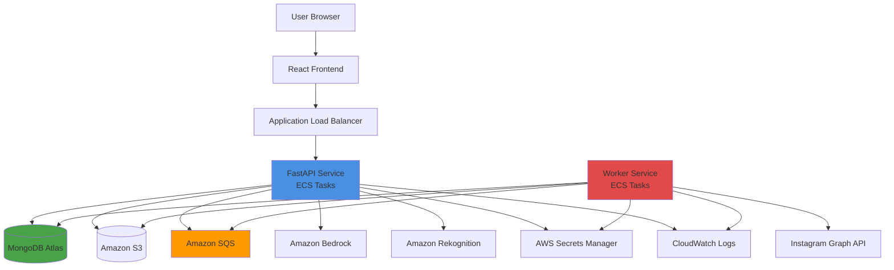

# Design Document: AutoSocial AI

## Overview

AutoSocial AI is a production-ready SaaS platform that automates social media content creation and publishing for businesses. The system uses AI to generate engaging campaigns from product images, schedules posts, and publishes them to Instagram automatically.

### System Purpose

The platform solves the problem of time-consuming social media management by:
- Analyzing product images using Amazon Rekognition
- Generating contextually relevant captions and hashtags using Amazon Bedrock
- Scheduling posts for optimal engagement times
- Publishing content to Instagram automatically
- Tracking performance analytics

### Technology Stack

**Frontend:**
- React 18 with Vite for fast development and optimized builds
- Axios for HTTP client with interceptors for authentication
- React Router for navigation
- JWT stored in localStorage for authentication

**Backend:**
- Python 3.11 with FastAPI for async API development
- Pydantic v2 for data validation and serialization
- Motor (async MongoDB driver) for database operations
- Boto3 for AWS service integration
- PyJWT for token generation and validation
- Bcrypt for password hashing (cost factor 12)
- Cryptography library for AES-256 encryption

**Database:**
- MongoDB Atlas (M10 cluster minimum for production)
- Compound indexes for query optimization
- TTL indexes for automatic data expiration

**Cloud Services:**
- AWS ECS Fargate for containerized deployment
- Amazon S3 for media storage with private bucket policy
- Amazon SQS Standard Queue for job processing
- Amazon Bedrock (Claude 3 Sonnet model) for campaign generation
- Amazon Rekognition for image analysis
- AWS Secrets Manager for encryption key storage
- CloudWatch for logging and monitoring

**External APIs:**
- Instagram Graph API v18.0
- OAuth 2.0 for Instagram authentication


## Architecture

### System Architecture Diagram



### Request Flow Patterns

#### Pattern 1: User Registration and Authentication
1. User submits email and password to React frontend
2. React sends POST /api/v1/auth/register to API service
3. API service validates input using Pydantic schema
4. API service hashes password with bcrypt (cost 12)
5. API service stores user document in MongoDB users collection
6. API service generates JWT access token (60 min expiry) and refresh token (7 days expiry)
7. API service returns tokens to React
8. React stores tokens in localStorage

#### Pattern 2: Instagram OAuth Connection
1. User clicks "Connect Instagram" in React
2. React redirects to Instagram OAuth URL with client_id and redirect_uri
3. User authorizes on Instagram
4. Instagram redirects back with authorization code
5. React sends code to POST /api/v1/instagram/callback
6. API service exchanges code for access_token and refresh_token via Instagram API
7. API service encrypts tokens using AES-256 with key from Secrets Manager
8. API service stores encrypted tokens in users collection
9. API service fetches Instagram user profile (username, user_id)
10. API service returns success to React


#### Pattern 3: Product Upload and Image Analysis
1. User uploads product (name, description, image file) via React form
2. React sends multipart/form-data POST to /api/v1/products
3. API service validates file type (JPEG, PNG only, max 10MB)
4. API service generates unique filename: `{user_id}/products/{uuid}.{ext}`
5. API service uploads image to S3 bucket asynchronously
6. API service sends image to Rekognition DetectLabels API
7. Rekognition returns labels with confidence scores
8. API service filters labels with confidence >= 75%
9. API service sorts labels by confidence descending and takes top 5
10. API service calls Rekognition DetectFaces to check for human presence
11. API service calls Rekognition DetectModerationLabels for content safety
12. API service creates product document in MongoDB with S3 URL and analysis results
13. API service returns product object to React

#### Pattern 4: AI Campaign Generation
1. User selects product and clicks "Generate Campaign" in React
2. React sends POST /api/v1/campaigns/generate with product_id and tone preference
3. API service retrieves product from MongoDB including image analysis
4. API service constructs Bedrock prompt with structured template
5. API service calls Bedrock InvokeModel API with Claude 3 Sonnet
6. Bedrock returns generated caption and hashtags
7. API service parses response and validates output format
8. API service applies hashtag generation algorithm (see Components section)
9. API service calculates optimal posting time based on user timezone
10. API service creates campaign document in MongoDB with status "draft"
11. API service returns campaign object to React

#### Pattern 5: Campaign Scheduling and Publishing
1. User selects campaign and scheduled time in React
2. React sends POST /api/v1/campaigns/{id}/schedule with scheduled_time
3. API service validates scheduled_time is in future
4. API service generates idempotency_key (UUIDv4)
5. API service updates campaign status to "scheduled" in MongoDB
6. API service creates SQS message with campaign_id and scheduled_time
7. API service returns success to React
8. Worker service polls SQS queue every 30 seconds
9. Worker receives message and queries MongoDB for campaign
10. Worker checks if scheduled_time <= current_time
11. Worker atomically updates campaign status: scheduled → publishing
12. Worker retrieves encrypted Instagram token from MongoDB
13. Worker decrypts token using key from Secrets Manager
14. Worker downloads image from S3 using pre-signed URL
15. Worker creates Instagram media container via Graph API
16. Worker publishes container to Instagram feed
17. Worker stores Instagram post_id in campaign document
18. Worker updates campaign status to "published"
19. Worker deletes SQS message
20. Worker logs success to CloudWatch


#### Pattern 6: Analytics Fetching
1. Scheduled CloudWatch Event triggers every 6 hours
2. Event invokes Worker service analytics task
3. Worker queries MongoDB for campaigns with status "published" and last_analytics_fetch > 24 hours ago
4. For each campaign, Worker calls Instagram Graph API Insights endpoint
5. Worker retrieves metrics: likes, comments, reach, impressions, engagement_rate
6. Worker stores metrics in analytics collection with timestamp
7. Worker updates campaign.last_analytics_fetch timestamp
8. When user views analytics dashboard, React calls GET /api/v1/analytics
9. API service aggregates metrics from analytics collection
10. API service calculates trends and summary statistics
11. API service returns analytics data to React

### Layered Architecture

The system follows clean architecture principles with clear separation of concerns:

**Layer 1: Presentation (React Frontend)**
- Components: Reusable UI components
- Pages: Route-level page components
- Services: API client functions using Axios
- Hooks: Custom React hooks for state management
- Auth: Authentication context and protected routes

**Layer 2: API Layer (FastAPI Routes)**
- Route handlers in `/routes` directory
- Input validation using Pydantic schemas
- JWT authentication middleware
- Rate limiting middleware
- Error handling middleware
- No business logic in routes (delegate to service layer)

**Layer 3: Service Layer (Business Logic)**
- CampaignService: Campaign generation and management
- InstagramService: Instagram API integration
- ImageAnalysisService: Rekognition integration
- TokenService: Token encryption, decryption, refresh
- SchedulerService: SQS message management
- AnalyticsService: Metrics aggregation and calculation
- All services are async and testable with mocked dependencies

**Layer 4: Data Access Layer**
- Repository pattern for MongoDB operations
- UserRepository, ProductRepository, CampaignRepository, AnalyticsRepository
- Encapsulates query logic and index usage
- Returns domain models, not raw MongoDB documents

**Layer 5: Infrastructure Layer**
- AWS clients (S3, SQS, Bedrock, Rekognition, Secrets Manager)
- MongoDB connection management
- Configuration management
- Logging setup


## Components and Interfaces

### Frontend Components

#### AuthContext
```typescript
interface AuthContextType {
  user: User | null;
  accessToken: string | null;
  login: (email: string, password: string) => Promise<void>;
  logout: () => void;
  refreshToken: () => Promise<void>;
  isAuthenticated: boolean;
}
```

#### API Client Service
```typescript
class ApiClient {
  private baseURL: string;
  private axiosInstance: AxiosInstance;
  
  constructor() {
    this.axiosInstance = axios.create({
      baseURL: import.meta.env.VITE_API_BASE_URL,
      timeout: 30000,
    });
    
    // Request interceptor to add JWT token
    this.axiosInstance.interceptors.request.use((config) => {
      const token = localStorage.getItem('access_token');
      if (token) {
        config.headers.Authorization = `Bearer ${token}`;
      }
      return config;
    });
    
    // Response interceptor to handle 401 and refresh token
    this.axiosInstance.interceptors.response.use(
      (response) => response,
      async (error) => {
        if (error.response?.status === 401) {
          // Attempt token refresh
          const refreshToken = localStorage.getItem('refresh_token');
          if (refreshToken) {
            try {
              const response = await this.refreshAccessToken(refreshToken);
              localStorage.setItem('access_token', response.access_token);
              // Retry original request
              error.config.headers.Authorization = `Bearer ${response.access_token}`;
              return this.axiosInstance.request(error.config);
            } catch {
              // Refresh failed, redirect to login
              window.location.href = '/login';
            }
          }
        }
        return Promise.reject(error);
      }
    );
  }
  
  async post<T>(url: string, data: any): Promise<T> {
    const response = await this.axiosInstance.post(url, data);
    return response.data;
  }
  
  async get<T>(url: string, params?: any): Promise<T> {
    const response = await this.axiosInstance.get(url, { params });
    return response.data;
  }
}
```

### Backend Service Interfaces

#### CampaignService
```python
class CampaignService:
    def __init__(
        self,
        campaign_repo: CampaignRepository,
        product_repo: ProductRepository,
        bedrock_client: BedrockClient,
        scheduler_service: SchedulerService
    ):
        self.campaign_repo = campaign_repo
        self.product_repo = product_repo
        self.bedrock_client = bedrock_client
        self.scheduler_service = scheduler_service
    
    async def generate_campaign(
        self,
        user_id: str,
        product_id: str,
        tone: str,
        idempotency_key: str
    ) -> Campaign:
        """
        Generate AI campaign for a product.
        
        Algorithm:
        1. Check idempotency_key in database
        2. If exists, return existing campaign
        3. Retrieve product with image analysis
        4. Construct Bedrock prompt
        5. Call Bedrock API with retry logic
        6. Parse and validate response
        7. Apply hashtag generation algorithm
        8. Calculate optimal posting time
        9. Store campaign in database
        10. Return campaign object
        """
        pass
    
    async def schedule_campaign(
        self,
        user_id: str,
        campaign_id: str,
        scheduled_time: datetime
    ) -> Campaign:
        """
        Schedule campaign for future publishing.
        
        Algorithm:
        1. Validate scheduled_time > now
        2. Atomically update campaign status to "scheduled"
        3. Send message to SQS queue
        4. Return updated campaign
        """
        pass
```


#### InstagramService
```python
class InstagramService:
    def __init__(
        self,
        user_repo: UserRepository,
        token_service: TokenService,
        http_client: httpx.AsyncClient
    ):
        self.user_repo = user_repo
        self.token_service = token_service
        self.http_client = http_client
        self.graph_api_base = "https://graph.instagram.com/v18.0"
    
    async def exchange_code_for_token(
        self,
        code: str,
        redirect_uri: str
    ) -> InstagramTokens:
        """
        Exchange OAuth code for access and refresh tokens.
        
        Algorithm:
        1. POST to Instagram token endpoint with code
        2. Parse response for access_token, refresh_token, expires_in
        3. Return tokens object
        """
        pass
    
    async def publish_post(
        self,
        user_id: str,
        image_url: str,
        caption: str
    ) -> str:
        """
        Publish post to Instagram feed.
        
        Algorithm:
        1. Retrieve and decrypt Instagram token
        2. Check token expiry, refresh if needed
        3. Create media container via POST /{ig_user_id}/media
        4. Poll container status until ready (max 30 seconds)
        5. Publish container via POST /{ig_user_id}/media_publish
        6. Return Instagram post_id
        
        Retry Logic:
        - Retry on 5xx errors: 3 attempts with exponential backoff (1s, 2s, 4s)
        - Retry on 429: Wait for retry-after header duration
        - No retry on 4xx errors (except 429)
        """
        pass
    
    async def fetch_insights(
        self,
        user_id: str,
        post_id: str
    ) -> InstagramInsights:
        """
        Fetch post insights from Instagram.
        
        Algorithm:
        1. Retrieve and decrypt Instagram token
        2. GET /{post_id}/insights with metrics: likes, comments, reach, impressions
        3. Parse response and return insights object
        """
        pass
```

#### ImageAnalysisService
```python
class ImageAnalysisService:
    def __init__(self, rekognition_client: RekognitionClient):
        self.rekognition_client = rekognition_client
    
    async def analyze_image(self, image_bytes: bytes) -> ImageAnalysis:
        """
        Analyze product image using Amazon Rekognition.
        
        Algorithm:
        1. Call DetectLabels with MinConfidence=75, MaxLabels=20
        2. Filter labels with Confidence >= 75
        3. Sort by Confidence descending
        4. Take top 5 labels
        5. Call DetectFaces to check for human presence
        6. Call DetectModerationLabels to check content safety
        7. Extract dominant colors from label data
        8. Return ImageAnalysis object
        
        ImageAnalysis structure:
        {
            "labels": ["Clothing", "Fashion", "Apparel", "Dress", "Evening Dress"],
            "confidence_scores": [98.5, 96.2, 94.8, 92.1, 89.3],
            "has_faces": false,
            "dominant_colors": ["#1A1A1A", "#FFFFFF"],
            "is_safe": true
        }
        """
        pass
```


#### TokenService
```python
class TokenService:
    def __init__(self, secrets_client: SecretsManagerClient):
        self.secrets_client = secrets_client
        self.encryption_key = None
    
    async def get_encryption_key(self) -> bytes:
        """
        Retrieve encryption key from AWS Secrets Manager.
        Cache key in memory for 1 hour.
        """
        if self.encryption_key is None or self._key_expired():
            secret = await self.secrets_client.get_secret_value(
                SecretId="autosocial-ai/encryption-key"
            )
            self.encryption_key = base64.b64decode(secret["SecretString"])
            self._key_timestamp = datetime.utcnow()
        return self.encryption_key
    
    async def encrypt_token(self, token: str) -> str:
        """
        Encrypt Instagram token using AES-256-GCM.
        
        Algorithm:
        1. Get encryption key from Secrets Manager
        2. Generate random 12-byte nonce
        3. Create AES-GCM cipher with key and nonce
        4. Encrypt token bytes
        5. Concatenate: nonce + ciphertext + tag
        6. Base64 encode result
        7. Return encrypted string
        """
        key = await self.get_encryption_key()
        nonce = os.urandom(12)
        cipher = Cipher(
            algorithms.AES(key),
            modes.GCM(nonce),
            backend=default_backend()
        )
        encryptor = cipher.encryptor()
        ciphertext = encryptor.update(token.encode()) + encryptor.finalize()
        encrypted = nonce + ciphertext + encryptor.tag
        return base64.b64encode(encrypted).decode()
    
    async def decrypt_token(self, encrypted_token: str) -> str:
        """
        Decrypt Instagram token.
        
        Algorithm:
        1. Base64 decode encrypted string
        2. Extract nonce (first 12 bytes)
        3. Extract tag (last 16 bytes)
        4. Extract ciphertext (middle bytes)
        5. Create AES-GCM cipher with key, nonce, and tag
        6. Decrypt ciphertext
        7. Return plaintext token
        """
        key = await self.get_encryption_key()
        encrypted = base64.b64decode(encrypted_token)
        nonce = encrypted[:12]
        tag = encrypted[-16:]
        ciphertext = encrypted[12:-16]
        cipher = Cipher(
            algorithms.AES(key),
            modes.GCM(nonce, tag),
            backend=default_backend()
        )
        decryptor = cipher.decryptor()
        plaintext = decryptor.update(ciphertext) + decryptor.finalize()
        return plaintext.decode()
    
    async def refresh_instagram_token(
        self,
        user_id: str,
        refresh_token: str
    ) -> InstagramTokens:
        """
        Refresh Instagram access token.
        
        Algorithm:
        1. POST to Instagram token refresh endpoint
        2. Parse new access_token and expires_in
        3. Encrypt new token
        4. Update user document in database
        5. Return new tokens
        """
        pass
```


#### SchedulerService
```python
class SchedulerService:
    def __init__(self, sqs_client: SQSClient, queue_url: str):
        self.sqs_client = sqs_client
        self.queue_url = queue_url
    
    async def schedule_campaign(
        self,
        campaign_id: str,
        scheduled_time: datetime
    ) -> None:
        """
        Add campaign to SQS queue for processing.
        
        Algorithm:
        1. Calculate delay_seconds = (scheduled_time - now).total_seconds()
        2. If delay_seconds > 900 (15 min), set delay to 0 (worker will check time)
        3. Create message body with campaign_id and scheduled_time
        4. Generate message deduplication ID from campaign_id
        5. Send message to SQS with delay_seconds
        
        Note: SQS Standard Queue max delay is 15 minutes.
        For longer delays, worker polls and checks scheduled_time.
        """
        message_body = json.dumps({
            "campaign_id": campaign_id,
            "scheduled_time": scheduled_time.isoformat(),
            "job_type": "publish_campaign"
        })
        
        delay_seconds = int((scheduled_time - datetime.utcnow()).total_seconds())
        if delay_seconds > 900:
            delay_seconds = 0  # Worker will check scheduled_time
        
        await self.sqs_client.send_message(
            QueueUrl=self.queue_url,
            MessageBody=message_body,
            DelaySeconds=max(0, min(delay_seconds, 900)),
            MessageDeduplicationId=f"campaign-{campaign_id}",
            MessageGroupId=campaign_id  # For FIFO queue ordering
        )
    
    async def cancel_scheduled_campaign(
        self,
        campaign_id: str
    ) -> None:
        """
        Remove campaign from SQS queue.
        
        Algorithm:
        1. Receive messages from queue with campaign_id filter
        2. Delete matching messages
        3. Update campaign status to "cancelled" in database
        
        Note: SQS doesn't support direct message deletion by attribute.
        This is a best-effort operation.
        """
        pass
```

#### WorkerService
```python
class WorkerService:
    def __init__(
        self,
        sqs_client: SQSClient,
        campaign_repo: CampaignRepository,
        instagram_service: InstagramService,
        s3_client: S3Client,
        queue_url: str
    ):
        self.sqs_client = sqs_client
        self.campaign_repo = campaign_repo
        self.instagram_service = instagram_service
        self.s3_client = s3_client
        self.queue_url = queue_url
        self.max_concurrent_jobs = 5
    
    async def poll_and_process(self) -> None:
        """
        Main worker loop that polls SQS and processes jobs.
        
        Algorithm:
        1. Receive up to 10 messages from SQS (long polling 20 seconds)
        2. For each message, spawn async task to process
        3. Limit concurrent tasks to max_concurrent_jobs
        4. Wait for all tasks to complete
        5. Repeat indefinitely
        """
        while True:
            messages = await self.sqs_client.receive_message(
                QueueUrl=self.queue_url,
                MaxNumberOfMessages=10,
                WaitTimeSeconds=20,
                VisibilityTimeout=300  # 5 minutes
            )
            
            if not messages.get("Messages"):
                continue
            
            tasks = []
            for message in messages["Messages"]:
                task = asyncio.create_task(
                    self.process_message(message)
                )
                tasks.append(task)
                
                if len(tasks) >= self.max_concurrent_jobs:
                    await asyncio.gather(*tasks)
                    tasks = []
            
            if tasks:
                await asyncio.gather(*tasks)
```


    async def process_message(self, message: dict) -> None:
        """
        Process a single SQS message.
        
        Algorithm:
        1. Parse message body to extract campaign_id and scheduled_time
        2. Check if scheduled_time <= current_time
        3. If not ready, extend message visibility and return
        4. Atomically update campaign status: scheduled → publishing
        5. If update fails (already processed), delete message and return
        6. Try to publish campaign (with retry logic)
        7. If success: Update status to "published", delete SQS message
        8. If failure: Increment publish_attempts
        9. If publish_attempts >= 3: Update status to "failed", delete message
        10. If publish_attempts < 3: Update status to "scheduled", extend visibility
        """
        try:
            body = json.loads(message["Body"])
            campaign_id = body["campaign_id"]
            scheduled_time = datetime.fromisoformat(body["scheduled_time"])
            
            # Check if ready to publish
            if scheduled_time > datetime.utcnow():
                await self.sqs_client.change_message_visibility(
                    QueueUrl=self.queue_url,
                    ReceiptHandle=message["ReceiptHandle"],
                    VisibilityTimeout=300  # Check again in 5 minutes
                )
                return
            
            # Atomic status transition
            updated = await self.campaign_repo.atomic_status_update(
                campaign_id=campaign_id,
                from_status="scheduled",
                to_status="publishing"
            )
            
            if not updated:
                # Already processed by another worker
                await self.sqs_client.delete_message(
                    QueueUrl=self.queue_url,
                    ReceiptHandle=message["ReceiptHandle"]
                )
                return
            
            # Publish campaign
            campaign = await self.campaign_repo.get_by_id(campaign_id)
            
            try:
                post_id = await self.instagram_service.publish_post(
                    user_id=campaign.user_id,
                    image_url=campaign.image_url,
                    caption=campaign.caption
                )
                
                # Success
                await self.campaign_repo.update(
                    campaign_id=campaign_id,
                    status="published",
                    instagram_post_id=post_id,
                    published_at=datetime.utcnow()
                )
                
                await self.sqs_client.delete_message(
                    QueueUrl=self.queue_url,
                    ReceiptHandle=message["ReceiptHandle"]
                )
                
            except Exception as e:
                # Failure
                publish_attempts = campaign.publish_attempts + 1
                
                if publish_attempts >= 3:
                    # Max retries reached
                    await self.campaign_repo.update(
                        campaign_id=campaign_id,
                        status="failed",
                        publish_attempts=publish_attempts,
                        error_message=str(e)
                    )
                    await self.sqs_client.delete_message(
                        QueueUrl=self.queue_url,
                        ReceiptHandle=message["ReceiptHandle"]
                    )
                else:
                    # Retry later
                    await self.campaign_repo.update(
                        campaign_id=campaign_id,
                        status="scheduled",
                        publish_attempts=publish_attempts
                    )
                    await self.sqs_client.change_message_visibility(
                        QueueUrl=self.queue_url,
                        ReceiptHandle=message["ReceiptHandle"],
                        VisibilityTimeout=30  # Retry in 30 seconds
                    )
                
        except Exception as e:
            logger.error(f"Error processing message: {e}", exc_info=True)
```


## Data Models

### MongoDB Collections and Schemas

#### users Collection
```python
{
    "_id": ObjectId,
    "email": str,  # Unique index
    "hashed_password": str,  # Bcrypt hash with cost 12
    "instagram_user_id": str | None,
    "instagram_username": str | None,
    "instagram_access_token": str | None,  # AES-256 encrypted
    "instagram_refresh_token": str | None,  # AES-256 encrypted
    "instagram_token_expiry": datetime | None,
    "timezone": str,  # Default "UTC", IANA timezone format
    "role": str,  # "user" or "admin"
    "daily_campaign_quota": int,  # Default 50
    "campaigns_generated_today": int,  # Reset daily
    "quota_reset_date": date,
    "created_at": datetime,
    "updated_at": datetime
}

# Indexes:
# - email: unique
# - instagram_user_id: sparse
```

#### products Collection
```python
{
    "_id": ObjectId,
    "user_id": ObjectId,  # Foreign key to users
    "name": str,  # Max 200 characters
    "description": str,  # Max 2000 characters
    "image_url": str,  # S3 URL
    "image_analysis": {
        "labels": list[str],  # Top 5 labels
        "confidence_scores": list[float],
        "has_faces": bool,
        "dominant_colors": list[str],  # Hex color codes
        "is_safe": bool
    },
    "created_at": datetime,
    "updated_at": datetime,
    "deleted_at": datetime | None  # Soft delete
}

# Indexes:
# - user_id: ascending
# - (user_id, created_at): compound, descending on created_at
# - deleted_at: sparse (for filtering soft-deleted)
```

#### campaigns Collection
```python
{
    "_id": ObjectId,
    "user_id": ObjectId,  # Foreign key to users
    "product_id": ObjectId,  # Foreign key to products
    "image_url": str,  # S3 URL (copied from product)
    "caption": str,  # Max 2200 characters (Instagram limit)
    "hashtags": list[str],  # Max 10 hashtags
    "tone": str,  # "luxury" | "minimal" | "festive" | "casual"
    "status": str,  # "draft" | "scheduled" | "publishing" | "published" | "failed" | "cancelled"
    "scheduled_time": datetime | None,
    "published_at": datetime | None,
    "instagram_post_id": str | None,
    "publish_attempts": int,  # Default 0
    "error_message": str | None,
    "idempotency_key": str,  # UUIDv4, unique index
    "bedrock_model_version": str,  # e.g., "claude-3-sonnet-20240229"
    "prompt_template_version": str,  # e.g., "v1.0"
    "created_at": datetime,
    "updated_at": datetime
}

# Indexes:
# - user_id: ascending
# - (user_id, scheduled_time): compound
# - (user_id, status): compound
# - scheduled_time: ascending (for worker queries)
# - idempotency_key: unique
# - instagram_post_id: sparse
```


#### analytics Collection
```python
{
    "_id": ObjectId,
    "campaign_id": ObjectId,  # Foreign key to campaigns
    "user_id": ObjectId,  # Denormalized for query efficiency
    "instagram_post_id": str,
    "likes": int,
    "comments": int,
    "reach": int,
    "impressions": int,
    "engagement_rate": float,  # Calculated: (likes + comments) / reach
    "fetched_at": datetime,
    "created_at": datetime
}

# Indexes:
# - campaign_id: ascending
# - (user_id, fetched_at): compound, descending on fetched_at
# - instagram_post_id: ascending
```

#### rate_limits Collection (for distributed rate limiting)
```python
{
    "_id": str,  # Format: "rate_limit:{user_id}:{endpoint}"
    "tokens": int,  # Current token count
    "capacity": int,  # Maximum tokens
    "refill_rate": int,  # Tokens per minute
    "last_refill": datetime,
    "expires_at": datetime  # TTL index
}

# Indexes:
# - expires_at: TTL index with expireAfterSeconds=0
```

### Pydantic Schemas

#### Request Schemas
```python
class UserRegisterRequest(BaseModel):
    email: EmailStr
    password: str = Field(min_length=8, max_length=128)
    timezone: str = Field(default="UTC")
    
    @field_validator("password")
    def validate_password_strength(cls, v):
        if not any(c.isupper() for c in v):
            raise ValueError("Password must contain uppercase letter")
        if not any(c.islower() for c in v):
            raise ValueError("Password must contain lowercase letter")
        if not any(c.isdigit() for c in v):
            raise ValueError("Password must contain digit")
        return v

class UserLoginRequest(BaseModel):
    email: EmailStr
    password: str

class ProductCreateRequest(BaseModel):
    name: str = Field(min_length=1, max_length=200)
    description: str = Field(min_length=1, max_length=2000)
    # image uploaded as multipart/form-data

class CampaignGenerateRequest(BaseModel):
    product_id: str
    tone: Literal["luxury", "minimal", "festive", "casual"]
    idempotency_key: str = Field(default_factory=lambda: str(uuid.uuid4()))

class CampaignScheduleRequest(BaseModel):
    scheduled_time: datetime
    
    @field_validator("scheduled_time")
    def validate_future_time(cls, v):
        if v <= datetime.utcnow():
            raise ValueError("Scheduled time must be in the future")
        if v > datetime.utcnow() + timedelta(days=90):
            raise ValueError("Cannot schedule more than 90 days in advance")
        return v
```


#### Response Schemas
```python
class StandardResponse(BaseModel, Generic[T]):
    success: bool
    data: T | None = None
    error: str | None = None
    timestamp: datetime = Field(default_factory=datetime.utcnow)

class TokenResponse(BaseModel):
    access_token: str
    refresh_token: str
    token_type: str = "bearer"
    expires_in: int  # Seconds

class UserResponse(BaseModel):
    id: str
    email: str
    instagram_connected: bool
    instagram_username: str | None
    timezone: str
    created_at: datetime

class ProductResponse(BaseModel):
    id: str
    name: str
    description: str
    image_url: str
    image_analysis: dict
    created_at: datetime

class CampaignResponse(BaseModel):
    id: str
    product_id: str
    caption: str
    hashtags: list[str]
    tone: str
    status: str
    scheduled_time: datetime | None
    published_at: datetime | None
    instagram_post_id: str | None
    created_at: datetime

class AnalyticsResponse(BaseModel):
    campaign_id: str
    likes: int
    comments: int
    reach: int
    impressions: int
    engagement_rate: float
    fetched_at: datetime
```

### Domain Models (Internal)
```python
@dataclass
class User:
    id: str
    email: str
    hashed_password: str
    instagram_user_id: str | None
    instagram_username: str | None
    instagram_access_token: str | None
    instagram_refresh_token: str | None
    instagram_token_expiry: datetime | None
    timezone: str
    role: str
    daily_campaign_quota: int
    campaigns_generated_today: int
    quota_reset_date: date
    created_at: datetime
    updated_at: datetime

@dataclass
class Campaign:
    id: str
    user_id: str
    product_id: str
    image_url: str
    caption: str
    hashtags: list[str]
    tone: str
    status: CampaignStatus
    scheduled_time: datetime | None
    published_at: datetime | None
    instagram_post_id: str | None
    publish_attempts: int
    error_message: str | None
    idempotency_key: str
    bedrock_model_version: str
    prompt_template_version: str
    created_at: datetime
    updated_at: datetime

class CampaignStatus(Enum):
    DRAFT = "draft"
    SCHEDULED = "scheduled"
    PUBLISHING = "publishing"
    PUBLISHED = "published"
    FAILED = "failed"
    CANCELLED = "cancelled"
```


## Algorithms and Business Logic

### Image Analysis Algorithm

**Input:** Product image bytes (JPEG or PNG, max 10MB)

**Output:** ImageAnalysis object

**Steps:**
1. Validate image format and size
2. Call Rekognition DetectLabels API:
   - MinConfidence: 75
   - MaxLabels: 20
3. Filter labels where Confidence >= 75
4. Sort labels by Confidence descending
5. Take top 5 labels
6. Call Rekognition DetectFaces API:
   - Extract face_count
   - Set has_faces = (face_count > 0)
7. Call Rekognition DetectModerationLabels API:
   - Check for inappropriate content
   - Set is_safe = (no labels with Confidence > 80)
8. Extract dominant colors from label metadata (if available)
9. Return ImageAnalysis object

**Error Handling:**
- If Rekognition API fails, log error and return partial analysis
- If image is unsafe (is_safe = false), reject product creation

### Campaign Generation Algorithm

**Input:** Product (with image analysis), tone preference

**Output:** Generated campaign (caption, hashtags, optimal posting time)

**Steps:**

1. **Construct Bedrock Prompt:**
```python
prompt_template = """You are a social media marketing expert specializing in Instagram content.

Product Information:
- Name: {product_name}
- Description: {product_description}
- Visual Elements: {labels}
- Dominant Colors: {colors}
- Contains Faces: {has_faces}

Task: Generate an engaging Instagram caption for this product.

Requirements:
- Tone: {tone}
- Length: 120-180 characters
- Include 1-2 relevant emojis (max 3 total)
- Include 1 clear call-to-action
- Be authentic and engaging
- Match the {tone} brand voice

Output Format (JSON):
{{
  "caption": "Your generated caption here",
  "suggested_hashtags": ["tag1", "tag2", "tag3"]
}}
"""

prompt = prompt_template.format(
    product_name=product.name,
    product_description=product.description,
    labels=", ".join(product.image_analysis.labels),
    colors=", ".join(product.image_analysis.dominant_colors),
    has_faces=product.image_analysis.has_faces,
    tone=tone
)
```

2. **Call Bedrock API:**
```python
response = await bedrock_client.invoke_model(
    modelId="anthropic.claude-3-sonnet-20240229-v1:0",
    body=json.dumps({
        "anthropic_version": "bedrock-2023-05-31",
        "max_tokens": 500,
        "temperature": 0.7,
        "messages": [
            {
                "role": "user",
                "content": prompt
            }
        ]
    })
)
```

3. **Parse Response:**
```python
response_body = json.loads(response["body"].read())
content = response_body["content"][0]["text"]
generated = json.loads(content)
caption = generated["caption"]
suggested_hashtags = generated["suggested_hashtags"]
```

4. **Apply Hashtag Generation Algorithm:**
```python
def generate_hashtags(
    suggested_hashtags: list[str],
    product_labels: list[str]
) -> list[str]:
    """
    Generate final hashtag list.
    
    Algorithm:
    1. Start with suggested_hashtags from Bedrock
    2. Convert to lowercase, remove spaces, prefix with #
    3. Add label-based hashtags from top 3 product labels
    4. Add fixed brand hashtags: #smallbusiness #shoponline #supportlocal
    5. Remove duplicates (case-insensitive)
    6. Limit to 10 total hashtags
    7. Return list
    """
    hashtags = set()
    
    # Add suggested hashtags
    for tag in suggested_hashtags:
        clean_tag = "#" + tag.lower().replace(" ", "").replace("#", "")
        hashtags.add(clean_tag)
    
    # Add label-based hashtags
    for label in product_labels[:3]:
        clean_tag = "#" + label.lower().replace(" ", "")
        hashtags.add(clean_tag)
    
    # Add fixed brand hashtags
    brand_tags = ["#smallbusiness", "#shoponline", "#supportlocal"]
    hashtags.update(brand_tags)
    
    # Limit to 10
    return list(hashtags)[:10]
```

5. **Calculate Optimal Posting Time:**
```python
def calculate_optimal_posting_time(user_timezone: str) -> datetime:
    """
    Calculate optimal posting time based on user timezone.
    
    Algorithm:
    1. Get current time in user's timezone
    2. Determine day of week
    3. If Monday-Friday: Suggest 18:00 (6 PM)
    4. If Saturday-Sunday: Suggest 11:00 (11 AM)
    5. If suggested time is in the past, add 1 day
    6. Convert to UTC for storage
    7. Return datetime
    """
    user_tz = pytz.timezone(user_timezone)
    now = datetime.now(user_tz)
    
    if now.weekday() < 5:  # Monday-Friday
        optimal_hour = 18
    else:  # Weekend
        optimal_hour = 11
    
    optimal_time = now.replace(hour=optimal_hour, minute=0, second=0, microsecond=0)
    
    if optimal_time <= now:
        optimal_time += timedelta(days=1)
    
    return optimal_time.astimezone(pytz.UTC)
```

6. **Create Campaign Document:**
```python
campaign = Campaign(
    id=str(ObjectId()),
    user_id=user_id,
    product_id=product_id,
    image_url=product.image_url,
    caption=caption,
    hashtags=hashtags,
    tone=tone,
    status=CampaignStatus.DRAFT,
    scheduled_time=None,
    published_at=None,
    instagram_post_id=None,
    publish_attempts=0,
    error_message=None,
    idempotency_key=idempotency_key,
    bedrock_model_version="claude-3-sonnet-20240229",
    prompt_template_version="v1.0",
    created_at=datetime.utcnow(),
    updated_at=datetime.utcnow()
)
```


### Rate Limiting Algorithm (Token Bucket)

**Implementation:** Token bucket algorithm with MongoDB-backed storage

**Configuration:**
- Capacity: 100 tokens per user
- Refill rate: 100 tokens per 60 seconds (1.67 tokens/second)
- Applies to: All authenticated API endpoints

**Algorithm:**
```python
async def check_rate_limit(user_id: str) -> tuple[bool, dict]:
    """
    Check if user has available tokens for request.
    
    Returns: (allowed: bool, headers: dict)
    
    Algorithm:
    1. Get current timestamp
    2. Fetch rate limit document from MongoDB
    3. If not exists, create new bucket with full capacity
    4. Calculate tokens to add based on time elapsed
    5. Refill bucket (up to capacity)
    6. If tokens >= 1, allow request and decrement
    7. If tokens < 1, deny request
    8. Update document in MongoDB
    9. Return result with rate limit headers
    """
    now = datetime.utcnow()
    bucket_id = f"rate_limit:{user_id}"
    
    # Fetch or create bucket
    bucket = await rate_limits_collection.find_one({"_id": bucket_id})
    
    if not bucket:
        bucket = {
            "_id": bucket_id,
            "tokens": 100.0,
            "capacity": 100,
            "refill_rate": 100,  # per minute
            "last_refill": now,
            "expires_at": now + timedelta(hours=1)
        }
        await rate_limits_collection.insert_one(bucket)
    
    # Calculate refill
    elapsed_seconds = (now - bucket["last_refill"]).total_seconds()
    tokens_to_add = (elapsed_seconds / 60.0) * bucket["refill_rate"]
    new_tokens = min(bucket["tokens"] + tokens_to_add, bucket["capacity"])
    
    # Check if request allowed
    if new_tokens >= 1.0:
        allowed = True
        new_tokens -= 1.0
    else:
        allowed = False
    
    # Update bucket
    await rate_limits_collection.update_one(
        {"_id": bucket_id},
        {
            "$set": {
                "tokens": new_tokens,
                "last_refill": now,
                "expires_at": now + timedelta(hours=1)
            }
        }
    )
    
    # Prepare headers
    headers = {
        "X-RateLimit-Limit": str(bucket["capacity"]),
        "X-RateLimit-Remaining": str(int(new_tokens)),
        "X-RateLimit-Reset": str(int((now + timedelta(minutes=1)).timestamp()))
    }
    
    if not allowed:
        retry_after = int(60 * (1.0 - new_tokens) / bucket["refill_rate"])
        headers["Retry-After"] = str(retry_after)
    
    return allowed, headers
```

**Middleware Integration:**
```python
@app.middleware("http")
async def rate_limit_middleware(request: Request, call_next):
    if request.url.path.startswith("/api/v1/"):
        user_id = get_user_id_from_token(request)
        if user_id:
            allowed, headers = await check_rate_limit(user_id)
            if not allowed:
                return JSONResponse(
                    status_code=429,
                    content={"error": "Rate limit exceeded"},
                    headers=headers
                )
    
    response = await call_next(request)
    return response
```


### Idempotency Strategy

**Purpose:** Ensure campaigns are never published twice, even with retries or duplicate requests

**Implementation Levels:**

#### Level 1: Campaign Creation Idempotency
```python
async def create_campaign_idempotent(
    user_id: str,
    product_id: str,
    tone: str,
    idempotency_key: str
) -> Campaign:
    """
    Create campaign with idempotency guarantee.
    
    Algorithm:
    1. Check if campaign with idempotency_key exists
    2. If exists, return existing campaign (idempotent)
    3. If not exists, generate campaign
    4. Store with idempotency_key
    5. Return new campaign
    """
    existing = await campaigns_collection.find_one({
        "user_id": ObjectId(user_id),
        "idempotency_key": idempotency_key
    })
    
    if existing:
        return Campaign.from_document(existing)
    
    # Generate new campaign
    campaign = await generate_campaign(user_id, product_id, tone)
    campaign.idempotency_key = idempotency_key
    
    await campaigns_collection.insert_one(campaign.to_document())
    return campaign
```

#### Level 2: Publishing Idempotency (Atomic Status Transition)
```python
async def atomic_status_update(
    campaign_id: str,
    from_status: str,
    to_status: str
) -> bool:
    """
    Atomically update campaign status.
    
    Algorithm:
    1. Use MongoDB findOneAndUpdate with filter on current status
    2. If document updated, return True
    3. If no document matched (status already changed), return False
    
    This ensures only ONE worker can transition status.
    """
    result = await campaigns_collection.find_one_and_update(
        {
            "_id": ObjectId(campaign_id),
            "status": from_status
        },
        {
            "$set": {
                "status": to_status,
                "updated_at": datetime.utcnow()
            }
        },
        return_document=ReturnDocument.AFTER
    )
    
    return result is not None
```

#### Level 3: Instagram API Idempotency Check
```python
async def publish_with_idempotency_check(
    user_id: str,
    campaign_id: str,
    image_url: str,
    caption: str
) -> str:
    """
    Publish to Instagram with idempotency verification.
    
    Algorithm:
    1. Check if campaign already has instagram_post_id
    2. If yes, verify post exists on Instagram
    3. If exists, return existing post_id (idempotent)
    4. If not exists, proceed with publishing
    5. Create media container
    6. Publish container
    7. Return post_id
    """
    campaign = await campaigns_collection.find_one({"_id": ObjectId(campaign_id)})
    
    if campaign.get("instagram_post_id"):
        # Verify post exists
        try:
            post = await instagram_service.get_post(
                user_id=user_id,
                post_id=campaign["instagram_post_id"]
            )
            if post:
                return campaign["instagram_post_id"]
        except NotFoundError:
            # Post doesn't exist, proceed with publishing
            pass
    
    # Publish new post
    post_id = await instagram_service.create_and_publish(
        user_id=user_id,
        image_url=image_url,
        caption=caption
    )
    
    return post_id
```


### Instagram Publishing Algorithm

**Input:** Campaign with image_url and caption

**Output:** Instagram post_id

**Steps:**

1. **Retrieve and Decrypt Instagram Token:**
```python
user = await user_repo.get_by_id(user_id)
access_token = await token_service.decrypt_token(user.instagram_access_token)

# Check token expiry
if user.instagram_token_expiry <= datetime.utcnow():
    # Refresh token
    refresh_token = await token_service.decrypt_token(user.instagram_refresh_token)
    new_tokens = await instagram_service.refresh_token(refresh_token)
    access_token = new_tokens.access_token
    # Update user with new tokens
```

2. **Download Image from S3:**
```python
# Generate pre-signed URL (5 minute expiry)
presigned_url = await s3_client.generate_presigned_url(
    'get_object',
    Params={'Bucket': bucket_name, 'Key': image_key},
    ExpiresIn=300
)
```

3. **Create Instagram Media Container:**
```python
# POST to Instagram Graph API
container_response = await http_client.post(
    f"{graph_api_base}/{instagram_user_id}/media",
    data={
        "image_url": presigned_url,
        "caption": f"{caption}\n\n{' '.join(hashtags)}",
        "access_token": access_token
    },
    timeout=30.0
)

container_id = container_response.json()["id"]
```

4. **Poll Container Status:**
```python
# Wait for container to be ready (max 30 seconds)
max_attempts = 6
for attempt in range(max_attempts):
    status_response = await http_client.get(
        f"{graph_api_base}/{container_id}",
        params={
            "fields": "status_code",
            "access_token": access_token
        }
    )
    
    status_code = status_response.json()["status_code"]
    
    if status_code == "FINISHED":
        break
    elif status_code == "ERROR":
        raise InstagramPublishError("Container creation failed")
    
    await asyncio.sleep(5)
else:
    raise InstagramPublishError("Container creation timeout")
```

5. **Publish Container:**
```python
publish_response = await http_client.post(
    f"{graph_api_base}/{instagram_user_id}/media_publish",
    data={
        "creation_id": container_id,
        "access_token": access_token
    },
    timeout=30.0
)

post_id = publish_response.json()["id"]
```

6. **Return Post ID:**
```python
return post_id
```

**Error Handling and Retry Logic:**
```python
async def publish_with_retry(
    user_id: str,
    image_url: str,
    caption: str,
    hashtags: list[str]
) -> str:
    """
    Publish to Instagram with exponential backoff retry.
    
    Retry Policy:
    - 5xx errors: Retry 3 times with backoff (1s, 2s, 4s)
    - 429 rate limit: Wait for retry-after header, then retry
    - 4xx errors (except 429): No retry, raise immediately
    - Timeout: Retry 3 times
    """
    max_retries = 3
    base_delay = 1.0
    
    for attempt in range(max_retries):
        try:
            return await _publish_to_instagram(user_id, image_url, caption, hashtags)
        
        except httpx.HTTPStatusError as e:
            if e.response.status_code == 429:
                # Rate limit - wait for retry-after
                retry_after = int(e.response.headers.get("retry-after", 60))
                await asyncio.sleep(retry_after)
                continue
            
            elif 500 <= e.response.status_code < 600:
                # Server error - retry with backoff
                if attempt < max_retries - 1:
                    delay = base_delay * (2 ** attempt) + random.uniform(0, 1)
                    await asyncio.sleep(delay)
                    continue
                else:
                    raise
            
            else:
                # Client error - don't retry
                raise
        
        except httpx.TimeoutException:
            # Timeout - retry with backoff
            if attempt < max_retries - 1:
                delay = base_delay * (2 ** attempt)
                await asyncio.sleep(delay)
                continue
            else:
                raise
    
    raise InstagramPublishError("Max retries exceeded")
```


### Daily Quota Management Algorithm

**Purpose:** Limit AI campaign generation to control costs

**Configuration:**
- Default quota: 50 campaigns per user per day
- Reset time: 00:00 UTC daily

**Algorithm:**
```python
async def check_and_increment_quota(user_id: str) -> bool:
    """
    Check if user has remaining quota and increment counter.
    
    Returns: True if quota available, False if exceeded
    
    Algorithm:
    1. Get current date (UTC)
    2. Fetch user document
    3. If quota_reset_date != today, reset counter
    4. If campaigns_generated_today < daily_campaign_quota, allow
    5. Increment campaigns_generated_today
    6. Return result
    """
    today = datetime.utcnow().date()
    
    user = await users_collection.find_one({"_id": ObjectId(user_id)})
    
    # Reset quota if new day
    if user["quota_reset_date"] != today:
        await users_collection.update_one(
            {"_id": ObjectId(user_id)},
            {
                "$set": {
                    "campaigns_generated_today": 0,
                    "quota_reset_date": today
                }
            }
        )
        user["campaigns_generated_today"] = 0
    
    # Check quota
    if user["campaigns_generated_today"] >= user["daily_campaign_quota"]:
        return False
    
    # Increment counter
    await users_collection.update_one(
        {"_id": ObjectId(user_id)},
        {"$inc": {"campaigns_generated_today": 1}}
    )
    
    return True
```

**Middleware Integration:**
```python
@router.post("/campaigns/generate")
async def generate_campaign(
    request: CampaignGenerateRequest,
    user_id: str = Depends(get_current_user_id)
):
    # Check quota
    has_quota = await check_and_increment_quota(user_id)
    if not has_quota:
        raise HTTPException(
            status_code=429,
            detail="Daily campaign generation quota exceeded. Resets at 00:00 UTC."
        )
    
    # Proceed with generation
    campaign = await campaign_service.generate_campaign(...)
    return StandardResponse(success=True, data=campaign)
```

### Analytics Aggregation Algorithm

**Purpose:** Calculate summary statistics and trends from Instagram insights

**Input:** User ID, date range

**Output:** Aggregated analytics with trends

**Algorithm:**
```python
async def get_analytics_summary(
    user_id: str,
    start_date: datetime,
    end_date: datetime
) -> AnalyticsSummary:
    """
    Aggregate analytics across campaigns.
    
    Algorithm:
    1. Query analytics collection for user's campaigns in date range
    2. Calculate totals: sum of likes, comments, reach, impressions
    3. Calculate averages: mean engagement_rate
    4. Calculate trends: compare to previous period
    5. Identify top performing campaigns
    6. Return summary object
    """
    # Fetch analytics
    analytics = await analytics_collection.find({
        "user_id": ObjectId(user_id),
        "fetched_at": {"$gte": start_date, "$lte": end_date}
    }).to_list(length=None)
    
    if not analytics:
        return AnalyticsSummary.empty()
    
    # Calculate totals
    total_likes = sum(a["likes"] for a in analytics)
    total_comments = sum(a["comments"] for a in analytics)
    total_reach = sum(a["reach"] for a in analytics)
    total_impressions = sum(a["impressions"] for a in analytics)
    
    # Calculate averages
    avg_engagement_rate = sum(a["engagement_rate"] for a in analytics) / len(analytics)
    
    # Calculate trends (compare to previous period)
    period_length = (end_date - start_date).days
    prev_start = start_date - timedelta(days=period_length)
    prev_end = start_date
    
    prev_analytics = await analytics_collection.find({
        "user_id": ObjectId(user_id),
        "fetched_at": {"$gte": prev_start, "$lte": prev_end}
    }).to_list(length=None)
    
    if prev_analytics:
        prev_total_likes = sum(a["likes"] for a in prev_analytics)
        likes_trend = ((total_likes - prev_total_likes) / prev_total_likes * 100) if prev_total_likes > 0 else 0
    else:
        likes_trend = 0
    
    # Identify top campaigns
    top_campaigns = sorted(
        analytics,
        key=lambda a: a["engagement_rate"],
        reverse=True
    )[:5]
    
    return AnalyticsSummary(
        total_likes=total_likes,
        total_comments=total_comments,
        total_reach=total_reach,
        total_impressions=total_impressions,
        avg_engagement_rate=avg_engagement_rate,
        likes_trend_percent=likes_trend,
        top_campaigns=[a["campaign_id"] for a in top_campaigns],
        period_start=start_date,
        period_end=end_date
    )
```


## Correctness Properties

*A property is a characteristic or behavior that should hold true across all valid executions of a system—essentially, a formal statement about what the system should do. Properties serve as the bridge between human-readable specifications and machine-verifiable correctness guarantees.*

### Property 1: Password Hashing Integrity

*For any* user registration with a valid password, the stored password in the database should be hashed (not plaintext) and should verify successfully against the original password using bcrypt.

**Validates: Requirements 1.1, 11.1**

### Property 2: JWT Token Generation and Validation

*For any* valid user credentials, logging in should generate a valid JWT token that can be successfully validated and decoded to retrieve the user ID, and expired tokens should be rejected with authentication errors.

**Validates: Requirements 1.2, 1.3, 1.4**

### Property 3: Sensitive Data Encryption

*For any* sensitive data (Instagram tokens, refresh tokens), when stored in the database, the persisted value should be encrypted (not plaintext) and should decrypt back to the original value using the encryption service.

**Validates: Requirements 2.3, 11.2, 25.1**

### Property 4: Token Refresh on Expiry

*For any* expired Instagram access token, when an API operation requires the token, the system should automatically attempt to refresh it using the refresh token before proceeding with the operation.

**Validates: Requirements 2.4**

### Property 5: Tenant Isolation

*For any* user and any resource type (products, campaigns, analytics), querying or accessing resources should only return items belonging to that user, and attempts to access other users' resources should be rejected with authorization errors.

**Validates: Requirements 3.3, 3.4, 26.1, 26.3**

### Property 6: Image Analysis Structure

*For any* product image upload, the resulting image analysis should contain all required fields: labels (list), confidence_scores (list), has_faces (boolean), dominant_colors (list), and is_safe (boolean).

**Validates: Requirements 4.4**

### Property 7: Campaign Generation Structure

*For any* campaign generation request with valid product data, the resulting campaign should contain all required fields: caption (string, 120-180 chars), hashtags (list, max 10), tone (matching request), status (draft), and associated product_id and user_id.

**Validates: Requirements 5.2, 5.3**

### Property 8: Future Timestamp Validation

*For any* campaign scheduling request, if the scheduled_time is in the past or more than 90 days in the future, the request should be rejected with a validation error.

**Validates: Requirements 6.1**

### Property 9: Queue Message Creation

*For any* successfully scheduled campaign, a corresponding message should exist in the SQS queue containing the campaign_id and scheduled_time.

**Validates: Requirements 6.2**

### Property 10: Campaign Publishing Idempotency

*For any* campaign, attempting to publish it multiple times (with same campaign_id) should result in exactly one Instagram post being created, with subsequent attempts returning the existing post_id.

**Validates: Requirements 7.6, 18.1, 18.2, 18.5**

### Property 11: Analytics Association

*For any* analytics data stored, it should be correctly associated with a valid campaign_id, include a timestamp, and contain all required metrics (likes, comments, reach, impressions, engagement_rate).

**Validates: Requirements 8.2**

### Property 12: Retry with Exponential Backoff

*For any* external API call (Instagram, Bedrock, Rekognition) that fails with a retryable error (5xx, timeout), the system should retry up to 3 times with exponential backoff delays (1s, 2s, 4s for Instagram; 2s, 4s, 8s for Bedrock), and after exhausting retries, should move the job to the dead-letter queue.

**Validates: Requirements 9.3, 9.5, 19.1, 19.3, 19.4**

### Property 13: Rate Limit Retry-After Handling

*For any* API call that receives a 429 rate limit response with a retry-after header, the system should wait for the specified duration before retrying, not the standard exponential backoff.

**Validates: Requirements 19.2**

### Property 14: Backoff Jitter

*For any* retry operation using exponential backoff, the actual delay should include random jitter (variation) to prevent thundering herd, meaning multiple retries should have slightly different delay times even with the same base delay.

**Validates: Requirements 19.6**

### Property 15: Input Validation with Pydantic

*For any* API request with invalid input data (missing required fields, wrong types, out-of-range values), the system should reject the request with a 422 validation error before reaching business logic.

**Validates: Requirements 10.3, 11.3**

### Property 16: Rate Limiting Enforcement

*For any* user making authenticated API requests, after exceeding 100 requests in a 60-second window, subsequent requests should be rejected with 429 status and retry-after header until the rate limit window resets.

**Validates: Requirements 20.1**

### Property 17: Daily Campaign Quota Enforcement

*For any* user, after generating 50 campaigns in a single day (UTC), subsequent generation requests should be rejected with a quota exceeded error until the next day (00:00 UTC).

**Validates: Requirements 20.3**

### Property 18: Structured Logging Format

*For any* log entry emitted by the system, it should be valid JSON containing required fields: timestamp, service_name, log_level, trace_id, and message, and should never contain sensitive data (passwords, tokens, API keys).

**Validates: Requirements 22.1, 11.6**

### Property 19: Trace ID Propagation

*For any* incoming request, a unique trace_id should be generated (or extracted from headers) and should appear in all log entries and downstream service calls related to that request.

**Validates: Requirements 22.5**

### Property 20: Soft Delete Behavior

*For any* product deletion request, the product record should remain in the database with a deleted_at timestamp set, and subsequent queries should exclude soft-deleted products unless explicitly requested.

**Validates: Requirements 24.3**

### Property 21: Data Export Completeness

*For any* user data export request, the exported JSON should contain all of the user's products, campaigns, and analytics data with no missing records.

**Validates: Requirements 24.5**

### Property 22: Timeout Configuration

*For any* external API client (Instagram, Bedrock, Rekognition), the HTTP client should be configured with appropriate connection and response timeouts (Instagram: 10s/30s, Bedrock: 5s/15s, Rekognition: 5s/10s), and requests exceeding these timeouts should raise timeout exceptions.

**Validates: Requirements 30.1, 30.2, 30.3**

### Property 23: Circuit Breaker Behavior

*For any* external service, after 5 consecutive failures, the circuit breaker should open and reject requests immediately for 60 seconds without attempting the external call, then allow one test request (half-open state), and close the circuit if the test succeeds.

**Validates: Requirements 30.5, 30.6, 30.7**

### Property 24: Hashtag Generation Algorithm

*For any* campaign generation, the resulting hashtags should: (1) be lowercase, (2) have no spaces, (3) be prefixed with #, (4) include at least the fixed brand tags (#smallbusiness, #shoponline, #supportlocal), (5) be limited to maximum 10 total, and (6) have no duplicates.

**Validates: Requirements 5.2** (implicit in hashtag generation)

### Property 25: Encryption Round-Trip

*For any* plaintext token, encrypting then decrypting should produce the original token value (round-trip property).

**Validates: Requirements 25.1**


## Error Handling

### Error Response Format

All API errors follow a standardized format:

```python
{
    "success": false,
    "data": null,
    "error": "Human-readable error message",
    "error_code": "MACHINE_READABLE_CODE",
    "timestamp": "2024-01-15T10:30:00Z",
    "trace_id": "uuid-trace-id"
}
```

### Error Categories and HTTP Status Codes

**400 Bad Request:**
- Invalid input format
- Missing required fields
- Malformed JSON

**401 Unauthorized:**
- Missing JWT token
- Invalid JWT token
- Expired JWT token

**403 Forbidden:**
- Insufficient permissions
- Attempting to access another user's resources

**404 Not Found:**
- Resource does not exist
- Soft-deleted resource

**422 Unprocessable Entity:**
- Pydantic validation errors
- Business rule violations (e.g., scheduling in the past)

**429 Too Many Requests:**
- Rate limit exceeded
- Daily quota exceeded
- Includes retry-after header

**500 Internal Server Error:**
- Unexpected server errors
- Database connection failures
- Unhandled exceptions

**503 Service Unavailable:**
- External service unavailable (Instagram, Bedrock, Rekognition)
- Database unavailable
- Circuit breaker open
- Includes retry-after header

### Exception Hierarchy

```python
class AutoSocialError(Exception):
    """Base exception for all application errors"""
    def __init__(self, message: str, error_code: str):
        self.message = message
        self.error_code = error_code
        super().__init__(message)

class ValidationError(AutoSocialError):
    """Input validation errors (422)"""
    pass

class AuthenticationError(AutoSocialError):
    """Authentication failures (401)"""
    pass

class AuthorizationError(AutoSocialError):
    """Authorization failures (403)"""
    pass

class ResourceNotFoundError(AutoSocialError):
    """Resource not found (404)"""
    pass

class RateLimitError(AutoSocialError):
    """Rate limit exceeded (429)"""
    def __init__(self, message: str, retry_after: int):
        super().__init__(message, "RATE_LIMIT_EXCEEDED")
        self.retry_after = retry_after

class QuotaExceededError(AutoSocialError):
    """Daily quota exceeded (429)"""
    def __init__(self, message: str, reset_time: datetime):
        super().__init__(message, "QUOTA_EXCEEDED")
        self.reset_time = reset_time

class ExternalServiceError(AutoSocialError):
    """External service failures (503)"""
    def __init__(self, service: str, message: str):
        super().__init__(f"{service}: {message}", "EXTERNAL_SERVICE_ERROR")
        self.service = service

class InstagramPublishError(ExternalServiceError):
    """Instagram publishing failures"""
    def __init__(self, message: str):
        super().__init__("Instagram", message)

class BedrockError(ExternalServiceError):
    """Bedrock API failures"""
    def __init__(self, message: str):
        super().__init__("Bedrock", message)

class RekognitionError(ExternalServiceError):
    """Rekognition API failures"""
    def __init__(self, message: str):
        super().__init__("Rekognition", message)
```

### Error Handling Middleware

```python
@app.exception_handler(AutoSocialError)
async def autosocial_error_handler(request: Request, exc: AutoSocialError):
    status_code = {
        ValidationError: 422,
        AuthenticationError: 401,
        AuthorizationError: 403,
        ResourceNotFoundError: 404,
        RateLimitError: 429,
        QuotaExceededError: 429,
        ExternalServiceError: 503,
    }.get(type(exc), 500)
    
    headers = {}
    if isinstance(exc, RateLimitError):
        headers["Retry-After"] = str(exc.retry_after)
    elif isinstance(exc, QuotaExceededError):
        headers["X-Quota-Reset"] = exc.reset_time.isoformat()
    
    return JSONResponse(
        status_code=status_code,
        content={
            "success": False,
            "data": None,
            "error": exc.message,
            "error_code": exc.error_code,
            "timestamp": datetime.utcnow().isoformat(),
            "trace_id": request.state.trace_id
        },
        headers=headers
    )

@app.exception_handler(Exception)
async def generic_error_handler(request: Request, exc: Exception):
    logger.error(
        "Unhandled exception",
        exc_info=True,
        extra={"trace_id": request.state.trace_id}
    )
    
    return JSONResponse(
        status_code=500,
        content={
            "success": False,
            "data": None,
            "error": "An unexpected error occurred",
            "error_code": "INTERNAL_SERVER_ERROR",
            "timestamp": datetime.utcnow().isoformat(),
            "trace_id": request.state.trace_id
        }
    )
```

### Logging Strategy

**Log Levels:**
- **DEBUG**: Detailed diagnostic information (development only)
- **INFO**: General informational messages (request received, job started)
- **WARNING**: Warning messages (deprecated API usage, approaching limits)
- **ERROR**: Error messages (failed operations, external service errors)
- **CRITICAL**: Critical errors requiring immediate attention (database unavailable, security breaches)

**Structured Logging Format:**
```json
{
  "timestamp": "2024-01-15T10:30:00.123Z",
  "level": "ERROR",
  "service": "api-service",
  "trace_id": "uuid-trace-id",
  "user_id": "user-uuid",
  "message": "Failed to publish campaign",
  "error": "Instagram API timeout",
  "campaign_id": "campaign-uuid",
  "stack_trace": "..."
}
```

**What to Log:**
- All API requests (method, path, status, duration)
- Authentication attempts (success/failure)
- Campaign generation requests
- Publishing attempts (success/failure)
- External API calls (service, endpoint, status, duration)
- Queue message processing (received, completed, failed)
- Rate limit violations
- Quota exceeded events
- Circuit breaker state changes

**What NOT to Log:**
- Passwords (plaintext or hashed)
- JWT tokens
- Instagram access/refresh tokens
- Encryption keys
- API keys
- Full user data exports


## Testing Strategy

### Overview

The platform employs a comprehensive testing strategy combining unit tests, integration tests, property-based tests, and end-to-end tests to ensure reliability and correctness.

### Testing Pyramid

```
         /\
        /E2E\         <- 5% (Critical user flows)
       /------\
      /  INT   \      <- 25% (API endpoints, service integration)
     /----------\
    /   UNIT     \    <- 50% (Service layer, business logic)
   /--------------\
  / PROPERTY-BASED \ <- 20% (Correctness properties)
 /------------------\
```

### Unit Testing

**Scope:** Service layer components, utility functions, algorithms

**Framework:** pytest with pytest-asyncio for async tests

**Coverage Target:** 80% line coverage minimum

**Approach:**
- Mock all external dependencies (database, AWS services, HTTP clients)
- Test each service method in isolation
- Focus on business logic correctness
- Test error handling paths

**Example:**
```python
@pytest.mark.asyncio
async def test_campaign_service_generate_campaign():
    # Arrange
    mock_product_repo = Mock(ProductRepository)
    mock_bedrock = Mock(BedrockClient)
    mock_scheduler = Mock(SchedulerService)
    
    mock_product_repo.get_by_id.return_value = Product(
        id="prod-123",
        name="Test Product",
        image_analysis={"labels": ["Clothing", "Fashion"]}
    )
    
    mock_bedrock.invoke_model.return_value = {
        "caption": "Check out our new collection!",
        "hashtags": ["fashion", "style"]
    }
    
    service = CampaignService(
        campaign_repo=Mock(),
        product_repo=mock_product_repo,
        bedrock_client=mock_bedrock,
        scheduler_service=mock_scheduler
    )
    
    # Act
    campaign = await service.generate_campaign(
        user_id="user-123",
        product_id="prod-123",
        tone="luxury",
        idempotency_key="key-123"
    )
    
    # Assert
    assert campaign.caption == "Check out our new collection!"
    assert len(campaign.hashtags) <= 10
    assert "#smallbusiness" in campaign.hashtags
    mock_bedrock.invoke_model.assert_called_once()
```

### Integration Testing

**Scope:** API endpoints, database operations, service interactions

**Framework:** pytest with TestClient (FastAPI)

**Database:** Test MongoDB instance or MongoDB in-memory

**Approach:**
- Test complete request-response cycles
- Use real database (test instance)
- Mock only external APIs (Instagram, Bedrock, Rekognition)
- Test authentication and authorization
- Test error responses

**Example:**
```python
@pytest.mark.asyncio
async def test_create_product_endpoint(client: TestClient, auth_token: str):
    # Arrange
    product_data = {
        "name": "Test Product",
        "description": "A test product"
    }
    files = {"image": ("test.jpg", image_bytes, "image/jpeg")}
    
    # Act
    response = client.post(
        "/api/v1/products",
        data=product_data,
        files=files,
        headers={"Authorization": f"Bearer {auth_token}"}
    )
    
    # Assert
    assert response.status_code == 201
    data = response.json()
    assert data["success"] is True
    assert data["data"]["name"] == "Test Product"
    assert "image_url" in data["data"]
    
    # Verify in database
    product = await products_collection.find_one({"_id": ObjectId(data["data"]["id"])})
    assert product is not None
    assert product["user_id"] == get_user_id_from_token(auth_token)
```

### Property-Based Testing

**Scope:** Correctness properties from design document

**Framework:** Hypothesis (Python property-based testing library)

**Configuration:** Minimum 100 iterations per property test

**Approach:**
- Generate random valid inputs
- Test universal properties
- Verify invariants hold across all inputs
- Each property test references design document property

**Example:**
```python
from hypothesis import given, strategies as st

@given(
    password=st.text(min_size=8, max_size=128, alphabet=st.characters(blacklist_categories=('Cs',)))
)
@pytest.mark.asyncio
async def test_property_password_hashing_integrity(password: str):
    """
    Feature: autosocial-ai, Property 1: Password Hashing Integrity
    
    For any user registration with a valid password, the stored password
    in the database should be hashed (not plaintext) and should verify
    successfully against the original password using bcrypt.
    """
    # Arrange
    user_service = UserService(user_repo=UserRepository())
    
    # Act
    user = await user_service.register(
        email=f"test-{uuid.uuid4()}@example.com",
        password=password
    )
    
    # Assert
    stored_user = await users_collection.find_one({"_id": ObjectId(user.id)})
    
    # Password should be hashed (not plaintext)
    assert stored_user["hashed_password"] != password
    
    # Password should verify correctly
    assert bcrypt.checkpw(
        password.encode(),
        stored_user["hashed_password"].encode()
    )

@given(
    user_id=st.uuids(),
    campaign_count=st.integers(min_value=1, max_value=100)
)
@pytest.mark.asyncio
async def test_property_tenant_isolation(user_id: UUID, campaign_count: int):
    """
    Feature: autosocial-ai, Property 5: Tenant Isolation
    
    For any user and any resource type, querying should only return
    items belonging to that user.
    """
    # Arrange
    user1_id = str(user_id)
    user2_id = str(uuid.uuid4())
    
    # Create campaigns for user1
    for _ in range(campaign_count):
        await campaigns_collection.insert_one({
            "user_id": ObjectId(user1_id),
            "caption": "Test",
            "status": "draft"
        })
    
    # Create campaigns for user2
    await campaigns_collection.insert_one({
        "user_id": ObjectId(user2_id),
        "caption": "Test",
        "status": "draft"
    })
    
    # Act
    user1_campaigns = await campaign_repo.get_by_user(user1_id)
    
    # Assert
    assert len(user1_campaigns) == campaign_count
    assert all(c.user_id == user1_id for c in user1_campaigns)
    assert not any(c.user_id == user2_id for c in user1_campaigns)

@given(
    plaintext=st.text(min_size=1, max_size=1000)
)
@pytest.mark.asyncio
async def test_property_encryption_round_trip(plaintext: str):
    """
    Feature: autosocial-ai, Property 25: Encryption Round-Trip
    
    For any plaintext token, encrypting then decrypting should produce
    the original token value.
    """
    # Arrange
    token_service = TokenService(secrets_client=Mock())
    
    # Act
    encrypted = await token_service.encrypt_token(plaintext)
    decrypted = await token_service.decrypt_token(encrypted)
    
    # Assert
    assert decrypted == plaintext
    assert encrypted != plaintext  # Should be encrypted
```

### End-to-End Testing

**Scope:** Critical user flows

**Framework:** Playwright or Selenium for frontend, pytest for backend

**Approach:**
- Test complete user journeys
- Use staging environment
- Mock external services (Instagram, Bedrock)
- Test across browsers

**Critical Flows:**
1. User registration → Login → Connect Instagram → Upload product → Generate campaign → Schedule → Verify published
2. User login → View analytics → Export data
3. Rate limit enforcement → Quota enforcement

### Load Testing

**Tool:** Locust or k6

**Scenarios:**
- 100 concurrent users making API requests
- 500 concurrent users (stress test)
- Campaign generation under load
- Worker processing throughput

**Metrics:**
- Response time (p50, p95, p99)
- Throughput (requests/second)
- Error rate
- Resource utilization (CPU, memory)

### Security Testing

**Scope:**
- SQL injection attempts (MongoDB injection)
- XSS attempts
- Authentication bypass attempts
- Authorization bypass attempts
- Rate limit bypass attempts
- CSRF protection

**Tools:**
- OWASP ZAP for automated scanning
- Manual penetration testing
- Dependency vulnerability scanning (Safety, Snyk)

### Mocking Strategy

**External Services to Mock:**
- Instagram Graph API (use httpx-mock or responses)
- Amazon Bedrock (use boto3 stubber)
- Amazon Rekognition (use boto3 stubber)
- Amazon S3 (use moto)
- Amazon SQS (use moto)
- AWS Secrets Manager (use moto)

**Example Mock:**
```python
import httpx_mock

@pytest.mark.asyncio
async def test_instagram_publish_with_mock(httpx_mock: HTTPXMock):
    # Mock Instagram API responses
    httpx_mock.add_response(
        url="https://graph.instagram.com/v18.0/123/media",
        method="POST",
        json={"id": "container-123"}
    )
    
    httpx_mock.add_response(
        url="https://graph.instagram.com/v18.0/container-123",
        method="GET",
        json={"status_code": "FINISHED"}
    )
    
    httpx_mock.add_response(
        url="https://graph.instagram.com/v18.0/123/media_publish",
        method="POST",
        json={"id": "post-456"}
    )
    
    # Test publishing
    instagram_service = InstagramService(...)
    post_id = await instagram_service.publish_post(
        user_id="user-123",
        image_url="https://example.com/image.jpg",
        caption="Test caption"
    )
    
    assert post_id == "post-456"
```

### Continuous Integration

**Pipeline Steps:**
1. Lint (flake8, black, mypy)
2. Unit tests (with coverage report)
3. Integration tests
4. Property-based tests (100 iterations)
5. Security scanning
6. Build Docker images
7. Deploy to staging
8. Run E2E tests
9. Load tests (on staging)
10. Deploy to production (manual approval)

**Coverage Requirements:**
- Overall: 80% minimum
- Service layer: 90% minimum
- Critical paths (auth, publishing): 95% minimum

### Test Data Management

**Strategy:**
- Use factories (factory_boy) for test data generation
- Seed test database with realistic data
- Clean up after each test (pytest fixtures)
- Use transactions for test isolation

**Example Factory:**
```python
import factory

class UserFactory(factory.Factory):
    class Meta:
        model = User
    
    id = factory.LazyFunction(lambda: str(uuid.uuid4()))
    email = factory.Faker('email')
    hashed_password = factory.LazyFunction(lambda: bcrypt.hashpw(b"password123", bcrypt.gensalt()).decode())
    timezone = "UTC"
    role = "user"
    daily_campaign_quota = 50
    campaigns_generated_today = 0

class ProductFactory(factory.Factory):
    class Meta:
        model = Product
    
    id = factory.LazyFunction(lambda: str(uuid.uuid4()))
    user_id = factory.LazyFunction(lambda: str(uuid.uuid4()))
    name = factory.Faker('word')
    description = factory.Faker('sentence')
    image_url = factory.Faker('image_url')
    image_analysis = {
        "labels": ["Product", "Item"],
        "confidence_scores": [95.0, 90.0],
        "has_faces": False,
        "dominant_colors": ["#FFFFFF"],
        "is_safe": True
    }
```

